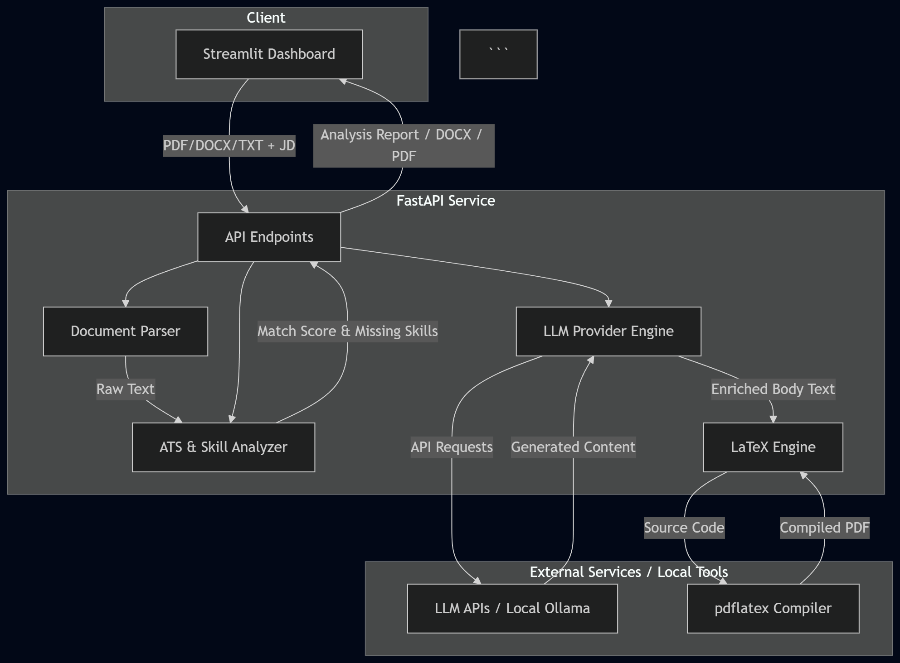

Here is the updated, production-ready `README.md` reflecting your direct SDK configuration, Experiential Labs gateway fallbacks, updated dependencies (`google-genai`), vector LaTeX engine fixes, and cleaned project directory structure.

```markdown
# AI Resume & CV Optimization Hub

[](https://www.python.org/downloads/)
[](https://fastapi.tiangolo.com/)
[](https://streamlit.io/)
[](https://scikit-learn.org/)
[](https://opensource.org/licenses/MIT)

---

## Table of Contents

- [Overview](#overview)
- [Use Cases](#use-cases)
- [System Architecture](#system-architecture)
- [Key Features](#key-features)
- [Technology Stack](#technology-stack)
- [Project Structure](#project-structure)
- [Getting Started](#getting-started)
  - [Prerequisites](#prerequisites)
  - [Installation & Setup](#installation--setup)
  - [Running the System](#running-the-system)
- [API Reference](#api-reference)
- [Configuration](#configuration)
- [Design Decisions](#design-decisions)
- [Roadmap](#roadmap)
- [Contributing](#contributing)
- [License](#license)

---

## Overview

A fast microservice that evaluates resume compatibility against job descriptions, pinpoints missing keywords, and generates job-tailored CVs using configurable LLM providers (Google GenAI, Groq, DeepSeek, OpenAI, Claude via Experiential Labs Gateway, OpenRouter, and Ollama) alongside local `pdflatex` compilation.

The application combines TF-IDF vector text similarity, dynamic keyword extraction, and LLM text enrichment to help candidates achieve high ATS match scores without deleting original career history, dates, or academic records.

---

## Use Cases

- **Job Application Tailoring**: Analyze and optimize resumes against specific job descriptions before submitting applications.
- **Multi-Format Export**: Generate clean, single-column ATS DOCX files or German `Lebenslauf` PDFs using vector-styled LaTeX templates.
- **Recruitment Screening**: Parse candidate documents and evaluate skill coverage against open position requirements.
- **Skill Gap Identification**: Flag specific tools, frameworks, and domain concepts missing from a candidate's profile.

---

## System Architecture



---

## Key Features

### Multi-Format Parsing

* Parses text from **PDF** (via `PyPDF`), **DOCX** (via `python-docx`), and plain **TXT** files.
* Extracts standard paragraphs alongside tabular data without cloud dependencies.

### Hybrid ATS Scoring & Skill Analysis

* **TF-IDF & Cosine Similarity**: Evaluates textual similarity against job posting requirements.
* **Dynamic Keyword Extraction**: Extracts technical nouns and skill terms from job descriptions to compute keyword density.
* **Skill Gap Reporting**: Identifies matched and missing technical skills.

### Additive LLM Resume Optimization

* **Fact-Preserving Enrichment**: Integrates missing target keywords into existing experience bullets and projects without deleting original companies, dates, or degree information.
* **Multi-Provider & Gateway Support**: Seamlessly switch between Google GenAI (`google-genai`), Groq, OpenRouter, DeepSeek, OpenAI, Anthropic Claude (routed via Experiential Labs Gateway), or local Ollama.
* **Strict Output Sanitization**: Strips conversational wrappers, markdown fences, and special LaTeX characters (`_`, `%`, `&`) from LLM responses before passing text to document generators.

### German Lebenslauf & ATS Templates

* **DOCX Generation**: Produces clean, single-column Word documents optimized for Applicant Tracking Systems.
* **LaTeX PDF Compilation**: Compiles German `Lebenslauf` documents using vector-based layout templates (`Corporate Slate Navy`, `Professional ATS`, `Classic Conservative`, `Modern Executive`, and `HR Executive Gold`).

---

## Technology Stack

| Category | Technology | Version |
| --- | --- | --- |
| **Language** | Python | 3.9+ |
| **Web Framework** | FastAPI | 0.110+ |
| **Frontend UI** | Streamlit | 1.30+ |
| **NLP & ML** | Scikit-Learn | 1.4+ |
| **Document Parsing** | PyPDF, Python-Docx | 4.0+ / 1.1+ |
| **Document Compilation** | TinyTeX / TeX Live (`pdflatex`) | System-level |
| **AI Providers** | Google GenAI (`google-genai`), Groq, OpenRouter, DeepSeek, OpenAI, Anthropic, HuggingFace Hub | Latest |

---

## Project Structure

```plaintext
ai-resume-analyzer/
│
├── app/
│   ├── api/
│   │   ├── __init__.py
│   │   └── endpoints.py         # REST routes (/analyze, /generate-full, /generate-german-cv)
│   │
│   ├── core/
│   │   ├── __init__.py
│   │   └── config.py            # Application settings & environment loader
│   │
│   ├── models/
│   │   ├── __init__.py
│   │   └── schemas.py           # Pydantic request & response models
│   │
│   ├── services/
│   │   ├── __init__.py
│   │   ├── analyzer.py          # Keyword extraction, TF-IDF, and scoring logic
│   │   ├── latex_generator.py   # LaTeX template rendering, link fixing, and pdflatex compilation
│   │   ├── llm_provider.py      # Tiered multi-provider LLM router & gateway fallback
│   │   ├── optimizer.py         # Additive CV optimization prompts
│   │   ├── parser.py            # Document extraction (PDF, DOCX, TXT)
│   │   └── suggestions.py       # Actionable improvement advice
│   │
│   ├── __init__.py
│   ├── dashboard.py             # Streamlit user interface
│   └── main.py                  # FastAPI application entry point
│
├── data/
│   ├── skills.json              # Keyword taxonomy fallback
│   └── llm_processing.jsonl     # Backend processing logs
│
├── images/
│   └── arch.png                 # Architecture diagram
│
├── tests/
│   ├── __init__.py
│   ├── test_analyzer.py
│   ├── test_api.py
│   ├── test_gateway.py
│   └── test_parser.py
│
├── .env.example
├── .gitignore
├── README.md
├── requirements.txt
└── run.py                       # Server launcher script

```

---

## Getting Started

### Prerequisites

* **Python**: 3.9 or higher
* **pip**: Package installer
* **LaTeX Engine**: `pdflatex` must be installed and available on your system PATH to compile PDF documents.
* *Linux (Ubuntu/Debian)*: `sudo apt install texlive-latex-base texlive-latex-extra`
* *macOS*: `brew install --cask mactex-no-gui`
* *Windows*: Install [MiKTeX](https://miktex.org/) or [TinyTeX](https://yihui.org/tinytex/).


---

### Installation & Setup

1. **Clone the repository**:
```bash
git clone [https://github.com/Baqir110/ai-resume-analyzer.git](https://github.com/Baqir110/ai-resume-analyzer.git)
cd ai-resume-analyzer

```


2. **Create and activate a virtual environment**:
```bash
python -m venv venv
source venv/bin/activate  # On Windows: .\venv\Scripts\activate

```


3. **Install Python dependencies**:
```bash
pip install --upgrade pip
pip install -r requirements.txt

```


4. **Configure environment variables**:
```bash
cp .env.example .env

```


Add your API keys to the `.env` file:
```env
# Gateway Configuration
OPENAI_BASE_URL=[https://api.experientiallabs.ai/v1](https://api.experientiallabs.ai/v1)
EXPERIENTIAL_ORG_KEY=your_experiential_org_key
DEFAULT_API_BASE=http://localhost:8000

# Provider API Keys
GEMINI_API_KEY=your_gemini_key
GROQ_API_KEY=your_groq_key
OPENROUTER_API_KEY=your_openrouter_key
DEEPSEEK_API_KEY=your_deepseek_key
OPENAI_API_KEY=your_openai_key
ANTHROPIC_API_KEY=your_claude_key
HF_TOKEN=your_huggingface_token

# Default Models
GEMINI_MODEL=gemini-2.5-flash
GROQ_MODEL=qwen3.8-27b
OPENROUTER_MODEL=deepseek-v4-flash
DEEPSEEK_MODEL=deepseek-v4-flash
OPENAI_MODEL=gpt-5.6-luna
CLAUDE_MODEL=claude-fable-5
OLLAMA_MODEL=qwen3.8-27b

# Paths & Endpoints
LLM_PROCESSING_LOG=data/llm_processing.jsonl
OLLAMA_BASE_URL=http://localhost:11434/api/generate

```


---

### Running the System

1. **Start the FastAPI Backend**:
```bash
python run.py
# Or using Uvicorn directly:
# uvicorn app.main:app --reload --host 0.0.0.0 --port 8000

```


Interactive API docs are accessible at [http://localhost:8000/docs](http://localhost:8000/docs).
2. **Start the Streamlit Dashboard**:
Open a second terminal window and run:
```bash
streamlit run app/dashboard.py

```


Access the dashboard UI in your browser at [http://localhost:8501](http://localhost:8501).

---

## API Reference

### `POST /api/v1/resume/analyze`

Analyzes an uploaded resume file against a target job description.

* **Request**: `multipart/form-data` (`resume_file`, `job_description`, `provider`)
* **Response**: JSON containing `ats_match_score`, `keyword_density_score`, `matching_skills`, `missing_skills`, and `improvement_suggestions`.

### `POST /api/v1/resume/generate-full`

Generates a complete, job-tailored ATS resume document.

* **Request**: `multipart/form-data` (`resume_file`, `job_description`, `provider`)
* **Response**: Binary `.docx` file stream.

### `POST /api/v1/resume/generate-german-cv`

Compiles a German `Lebenslauf` into a PDF using LaTeX.

* **Request**: `multipart/form-data` (`resume_file`, `job_description`, `layout_style`, `provider`)
* **Response**: Binary `.pdf` file stream.

### `POST /api/v1/resume/generate-tex-cv`

Returns raw LaTeX code for the selected layout style.

* **Request**: `multipart/form-data` (`resume_file`, `job_description`, `layout_style`, `provider`)
* **Response**: Plain text `.tex` content.

---

## Configuration

Environment variables control application defaults:

| Variable | Description | Default |
| --- | --- | --- |
| `SKILL_TAXONOMY_PATH` | Path to the taxonomy fallback file | `./data/skills.json` |
| `LLM_PROCESSING_LOG` | Path to JSONL request processing logs | `./data/llm_processing.jsonl` |
| `GEMINI_MODEL` | Default model for Google GenAI integration | `gemini-2.5-flash` |
| `OPENAI_BASE_URL` | Experiential Labs Gateway endpoint | `https://api.experientiallabs.ai/v1` |
| `OLLAMA_BASE_URL` | Local Ollama endpoint | `http://localhost:11434/api/generate` |

---

## Design Decisions

1. **Additive Optimization Rules**: Prompts enforce additive enrichment rather than full rewrites. This guarantees that company names, degree titles, employment dates, and original project entries remain intact while integrating missing keywords.
2. **Local LaTeX Compilation**: Generates PDFs using `pdflatex` via isolated temporary directories, removing external PDF-generation API costs and ensuring vector-graphics layout consistency.
3. **Tiered LLM Architecture**: Abstracted `LLMService` executes direct SDK calls (`google-genai`, `openai`, `anthropic`, `groq`) when native keys exist, automatically falling back to the Experiential Labs Gateway route for seamless execution.
4. **Stateless Processing**: Processing runs statelessly on input streams, logging request metadata locally without retaining personal user documents.

---

## Roadmap

* [x] Multi-provider LLM backend (Google GenAI, Groq, OpenRouter, DeepSeek, OpenAI, Claude via Gateway, Ollama).
* [x] Direct native execution with automatic gateway fallbacks.
* [x] Streamlit user interface with real-time analysis and export features.
* [x] Additive CV generation to prevent deletion of candidate information.
* [x] Vector German LaTeX template rendering and local `pdflatex` compilation.
* [ ] Automated visual diff preview (comparing original vs. optimized bullet points).
* [ ] Bulk CV analysis mode for reviewing multiple applicants against a single job posting.

---

## Contributing

Contributions are welcome!

1. Fork the repository.
2. Create a feature branch (`git checkout -b feature/improvement`).
3. Commit your updates (`git commit -m 'Add new layout style'`).
4. Push to your branch (`git push origin feature/improvement`).
5. Open a Pull Request.

---

## License

Distributed under the MIT License. See `LICENSE` for more information.

```

```