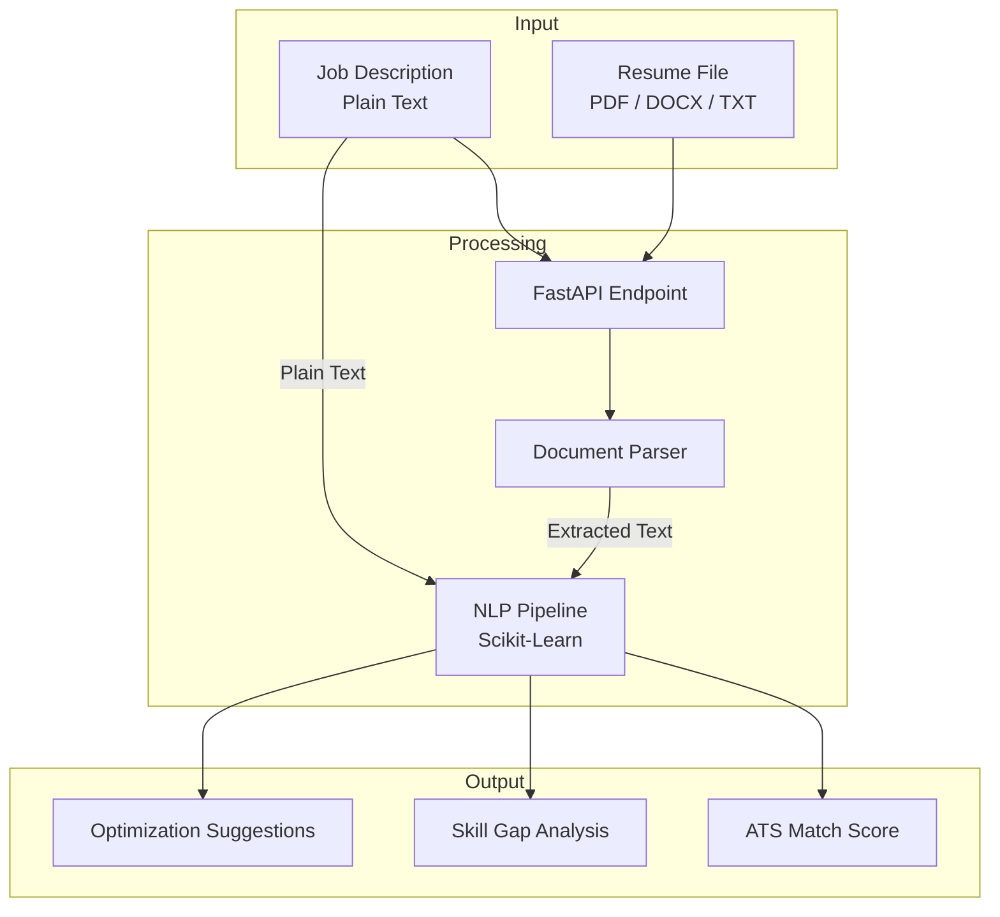

# AI Resume & CV Analyzer API

[](https://www.python.org/downloads/)
[](https://fastapi.tiangolo.com/)
[](https://scikit-learn.org/)
[](https://pypi.org/project/pypdf/)
[](https://docs.pytest.org/)
[](https://opensource.org/licenses/MIT)
[](http://makeapullrequest.com)

---

## 📋 Table of Contents

- [Overview](#overview)
- [Use Cases](#use-cases)
- [Architecture](#architecture)
- [Key Features](#key-features)
- [Technology Stack](#technology-stack)
- [Project Structure](#project-structure)
- [Getting Started](#getting-started)
  - [Prerequisites](#prerequisites)
  - [Installation](#installation)
  - [Running the Application](#running-the-application)
- [API Reference](#api-reference)
  - [Analyze Resume](#post-apiv1analyze)
- [Testing](#testing)
- [Configuration](#configuration)
- [Technical Decisions](#technical-decisions)
- [Roadmap](#roadmap)
- [Contributing](#contributing)
- [License](#license)
- [Contact](#contact)

---

## 📖 Overview

A **production-grade NLP microservice** built with FastAPI and Scikit-Learn that computes ATS compatibility scores, extracts skill gaps, and generates automated resume optimization insights.

This API helps job seekers and recruiters understand how well a resume matches a specific job description by leveraging **TF-IDF vectorization**, **cosine similarity**, and **keyword extraction**. The service returns structured, actionable feedback that can be integrated into recruiting platforms, career coaching tools, or automated application workflows.

**Key Differentiators**:
- **Semantic Matching**: Beyond keyword counting, uses TF-IDF to capture contextual relevance.
- **Actionable Insights**: Returns missing skills, matching strengths, and specific optimization tips.
- **Multi‑Format Support**: Parses PDF, DOCX, and plain text resumes without external API dependencies.
- **Self‑Contained NLP**: No external API calls or cloud dependencies — runs fully offline.

---

## 🎯 Use Cases

- **Job Application Assistant**: Automatically analyze and improve resumes before submission.
- **Recruitment Platforms**: Integrate into hiring dashboards to screen incoming applications.
- **Career Coaching**: Provide clients with data‑driven feedback on their CVs.
- **HR Analytics**: Aggregated skill gap analysis across multiple candidates.
- **ATS Optimization**: Tailor resumes to pass Applicant Tracking System filters.

---

## 🏗️ Architecture



### Data Flow

| Stage | Component | Description |
|-------|-----------|-------------|
| **Ingestion** | FastAPI Endpoint | Accepts job description (string) and uploaded resume file. |
| **Parsing** | Document Parser | Extracts text from PDF, DOCX, or TXT using PyPDF, Python-Docx, or built‑in readers. |
| **Vectorization** | Scikit-Learn TF-IDF | Converts both texts into TF-IDF vectors for semantic comparison. |
| **Matching** | Cosine Similarity | Computes similarity scores and identifies overlapping skills. |
| **Gap Analysis** | Keyword Extractor | Compares extracted skills against the job description to find missing terms. |
| **Output** | Structured JSON | Returns scores, skill lists, and actionable recommendations. |

---

## ⚡ Key Features

### 📄 Multi‑Format Parsing
- Supports **PDF** (via PyPDF), **DOCX** (via python-docx), and **TXT** (plain text).
- Graceful fallback for corrupted or unsupported formats.

### 🧠 NLP ATS Scoring
- **TF‑IDF Vectorization**: Weighted term frequency analysis to capture importance over frequency.
- **Cosine Similarity**: Semantic matching score (0–100%) indicating overall resume relevance.
- **Category‑wise Breakdown**: Scores for technical skills, experience relevance, and soft skills (where detected).

### 🔍 Skill Gap Analysis
- **Matching Skills**: Lists skills present in both the resume and the job description.
- **Missing Skills**: Highlights required skills absent from the resume.
- **Skill Categories**: Groups skills by domain (e.g., "Programming", "Cloud", "DevOps").

### 📋 Actionable Guidance
- **Tailored Recommendations**: Specific suggestions to improve alignment (e.g., "Add Python to Technical Skills section").
- **Keyword Density Feedback**: Advises on frequency and placement of important keywords.
- **Formatting Tips**: Recommendations for ATS‑friendly resume structure.

---

## 🛠️ Technology Stack

| Category | Technology | Version |
|----------|------------|---------|
| **Language** | Python | 3.9+ |
| **Web Framework** | FastAPI | 0.110+ |
| **NLP & ML** | Scikit-Learn | 1.4+ |
| **Data Processing** | Pandas, NumPy | - |
| **PDF Parsing** | PyPDF | 4.0+ |
| **DOCX Parsing** | Python-Docx | 1.1+ |
| **Testing** | Pytest, HTTPX | 7.0+ |
| **Code Quality** | Black, isort, Flake8 | - |

---

## 📁 Project Structure

```plaintext
ai-resume-analyzer/
│
├── app/
│   ├── __init__.py
│   ├── main.py                 # FastAPI application entry point
│   │
│   ├── api/
│   │   ├── __init__.py
│   │   └── endpoints.py        # REST API route definitions
│   │
│   ├── core/
│   │   ├── __init__.py
│   │   └── config.py           # Configuration settings
│   │
│   ├── models/
│   │   ├── __init__.py
│   │   └── schemas.py          # Pydantic request/response models
│   │
│   └── services/
│       ├── __init__.py
│       ├── parser.py           # Document parsing logic (PDF/DOCX/TXT)
│       ├── analyzer.py         # NLP analysis (TF-IDF, similarity, skill extraction)
│       └── suggestions.py      # Optimization recommendation generator
│
├── tests/
│   ├── __init__.py
│   ├── test_parser.py          # Document parsing tests
│   ├── test_analyzer.py        # NLP pipeline tests
│   └── test_api.py             # API endpoint tests
│
├── data/
│   └── skills.json             # Extendable skill taxonomy
│
├── .env.example                # Environment variables template
├── .gitignore
├── requirements.txt
├── pyproject.toml              # Black/isort configuration
└── README.md
```

---

## 🚀 Getting Started

### Prerequisites

- **Python** 3.9 or higher
- **pip** (Python package manager)
- **Git** (for cloning)

### Installation

1. **Clone the repository**

   ```bash
   git clone https://github.com/YOUR_USERNAME/ai-resume-analyzer.git
   cd ai-resume-analyzer
   ```

2. **Create and activate a virtual environment**

   ```bash
   python -m venv venv
   ```

   **Windows (PowerShell):**
   ```powershell
   .\venv\Scripts\Activate.ps1
   ```

   **macOS / Linux:**
   ```bash
   source venv/bin/activate
   ```

3. **Install dependencies**

   ```bash
   pip install --upgrade pip
   pip install -r requirements.txt
   ```

4. **(Optional) Configure environment**

   ```bash
   cp .env.example .env
   ```

### Running the Application

Start the server:

```bash
python -m uvicorn app.main:app --reload --host 0.0.0.0 --port 8000
```

Interactive API documentation (Swagger UI):  
👉 [http://127.0.0.1:8000/docs](http://127.0.0.1:8000/docs)

---

## 📚 API Reference

### `POST /api/v1/analyze`

**Description**: Analyzes a resume against a job description and returns ATS compatibility metrics, skill gaps, and optimization suggestions.

**Endpoint**: `POST /api/v1/analyze`

**Request**: `multipart/form-data`

| Parameter | Type | Required | Description |
|-----------|------|----------|-------------|
| `job_description` | string | Yes | The full job description text. |
| `resume_file` | file | Yes | Resume file (PDF, DOCX, or TXT). |
| `skill_taxonomy` | string | No | URL or path to custom skill list (JSON). |

**Example Request (cURL)**:
```bash
curl -X POST http://localhost:8000/api/v1/analyze \
  -F "job_description=We are looking for a Python developer with experience in FastAPI and Docker..." \
  -F "resume_file=@resume.pdf"
```

**Success Response (200)**:
```json
{
  "status": "success",
  "ats_score": 76.5,
  "matching_skills": ["Python", "FastAPI", "Docker", "PostgreSQL"],
  "missing_skills": ["Kubernetes", "Redis", "GraphQL"],
  "skill_gap_percentage": 30.0,
  "recommendations": [
    "Add Kubernetes to your 'Container Orchestration' section.",
    "Include Redis experience in your 'Caching & Performance' bullet points.",
    "Mention GraphQL under 'API Development' to increase alignment with the job description."
  ],
  "detailed_breakdown": {
    "technical_skills": 82.0,
    "experience_alignment": 71.0,
    "soft_skills": 65.0
  }
}
```

**Error Response (400)**:
```json
{
  "status": "error",
  "message": "Unsupported file format. Please upload PDF, DOCX, or TXT files."
}
```

---

## 🧪 Testing

Run the full test suite:

```bash
python -m pytest -v
```

**Coverage includes**:
- Document parsing for all supported formats.
- TF-IDF vectorization and similarity calculations.
- Skill extraction and gap analysis.
- API endpoint integration tests.

---

## ⚙️ Configuration

The application uses environment variables loaded from `.env`:

| Variable | Description | Default |
|----------|-------------|---------|
| `SKILL_TAXONOMY_PATH` | Path to custom skill taxonomy JSON | `./data/skills.json` |
| `MIN_SKILL_CONFIDENCE` | Minimum confidence threshold for skill extraction | `0.5` |
| `TOP_KEYWORDS_COUNT` | Number of top keywords to extract | `20` |
| `ATS_THRESHOLD_LOW` | Score below which is flagged as "Weak Match" | `40.0` |
| `ATS_THRESHOLD_MEDIUM` | Score below which is flagged as "Medium Match" | `65.0` |
| `MAX_FILE_SIZE` | Maximum uploaded file size (bytes) | `5 * 1024 * 1024` |

---

## 🧠 Technical Decisions

1. **TF‑IDF Over Embeddings**  
   While modern LLM embeddings (e.g., OpenAI, HuggingFace) could improve nuance, TF‑IDF was chosen for **offline performance**, **zero cost**, and **deterministic results**. It provides a solid baseline that can be upgraded to embeddings later.

2. **Skill Taxonomy as JSON**  
   A curated `skills.json` file allows easy customization without database overhead. The taxonomy can be extended to include industry‑specific terms, certifications, or tool names.

3. **Stateless Design**  
   The service is fully stateless — ideal for containerized microservices. No sessions, no caching, no persistent storage required (unless enabled for logging).

4. **Graceful Fallback Parsing**  
   If PDF parsing fails, the service attempts alternative extraction methods (e.g., `pdftotext` fallback). DOCX parsing handles both legacy `.doc` and modern `.docx` (where possible).

---

## 🗺️ Roadmap

- [ ] Add **LLM integration** (GPT, Mistral) for human‑like writing suggestions.
- [ ] Support **bulk resume analysis** (CSV/ZIP uploads).
- [ ] Add **resume template scoring** (e.g., ATS‑friendly formatting check).
- [ ] Implement **historical analytics** (track improvements across versions).
- [ ] Integrate **post‑revision diff** — compare changes and recompute score.
- [ ] Build a **Streamlit dashboard** for interactive resume optimization.

---

## 🤝 Contributing

Contributions are welcome! Please follow these steps:

1. Fork the repository.
2. Create a feature branch (`git checkout -b feature/amazing-feature`).
3. Commit your changes (`git commit -m 'Add amazing feature'`).
4. Push to the branch (`git push origin feature/amazing-feature`).
5. Open a Pull Request.

### Development Guidelines

- Follow **PEP 8** style guidelines.
- Write **docstrings** for all functions and classes.
- Add **unit tests** for new functionality.
- Update the **skill taxonomy** if adding new domains.

---

<p align="center">
  Made with ❤️ and 🐍 Python
</p>

<p align="center">
  ⭐ Star this repository if you find it useful!
</p>
