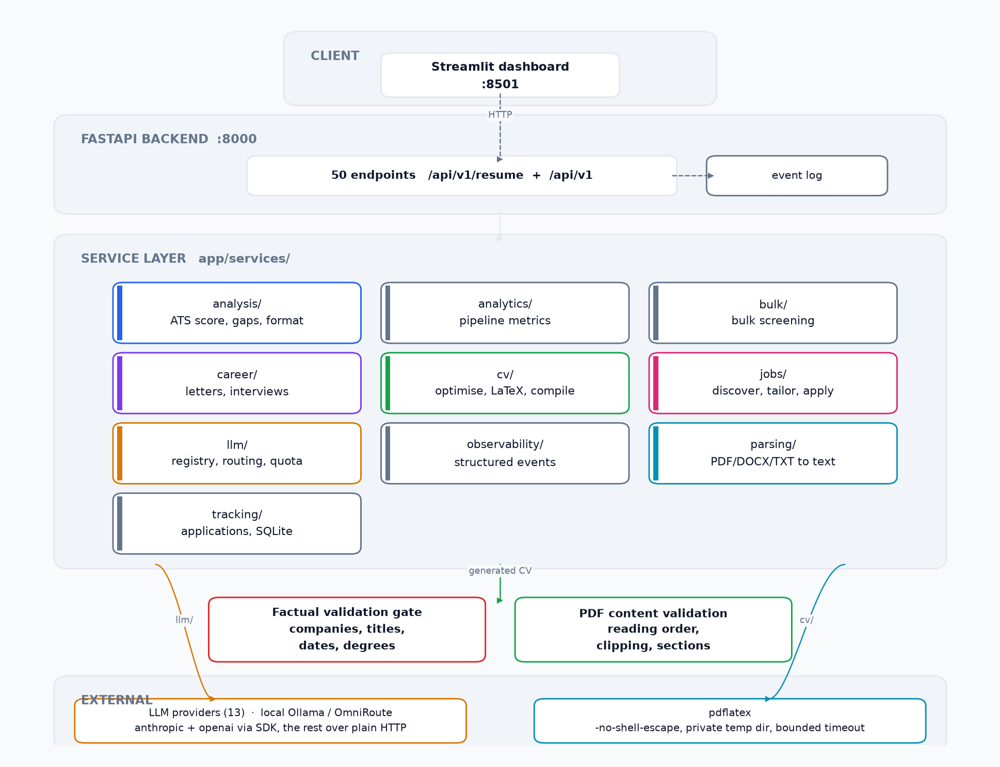

# AI Resume & CV Optimization Hub

[](https://www.python.org/downloads/)
[](https://fastapi.tiangolo.com/)
[](https://streamlit.io/)
[](https://docs.docker.com/compose/)

<!-- BEGIN:AUTO:STATS -->

| Metric | Value |
|--------|-------|
| API endpoints | 50 |
| Python files | 112 |
| Lines of code | 45,047 |
| Tests | 1296 |

<!-- END:AUTO:STATS -->

AI Resume analysis, optimisation and career application based on FastAPI, Streamlit and various LLM providers.
The platform also uses AI to compare resumes with job descriptions, flags missing skills and keywords, creates job-specific CVs (DOCX, LaTeX/PDF), allows for bulk CV analysis, tracks the usage of LLMs and provider quotas, and offers further career workflow features like cover letters, interview preparation, LinkedIn optimization, application tracking, and resume audit analysis.

---

## Table of Contents

- [Overview](#overview)
- [What's New](#whats-new)
- [Use Cases](#use-cases)
- [Key Features](#key-features)
- [System Architecture](#system-architecture)
- [Technology Stack](#technology-stack)
- [Project Structure](#project-structure)
- [Getting Started](#getting-started)
- [Running with Docker](#running-with-docker)
- [API Reference](#api-reference)
- [Configuration](#configuration)
- [LLM Providers](#llm-providers)
  - [Verified status](#verified-status)
  - [Free / Local LLM Options](#free--local-llm-options)
  - [Routing](#routing)
  - [Model discovery](#model-discovery)
  - [Smoke testing](#smoke-testing)
- [Observability](#observability)
- [Document Generation](#document-generation)
- [Career Workflow](#career-workflow)
- [Application Tracking](#application-tracking)
- [Testing](#testing)
- [Design Decisions](#design-decisions)
- [Roadmap](#roadmap)
- [Security](#security)
- [Known limitations](#known-limitations)
- [Contributing](#contributing)
- [License](#license)

---

## Overview

AI Resume & CV Optimization Hub is a resume intelligence and career application platform designed to evaluate candidate resumes against specific job descriptions and produce targeted improvements.

The system combines:

- TF-IDF and cosine similarity for deterministic ATS scoring
- Dynamic keyword and skill extraction
- Skill-gap analysis, with required skills reported as gaps and never added silently
- Weighted, per-category scoring whose total is reconstructible from its parts
- Bounded improvement loop that rejects any round introducing unsupported claims
- Layout recommendation from the posting, with the reasoning shown and the choice left to you
- Formatting and PDF-parsing diagnostics (reading order, columns, clipping, invisible text, font size)
- LLM-powered resume and CV optimization
- Multi-provider AI routing with automatic fallback
- Automatic layout selection based on job-description language
- Pre-flight resume translation for cross-language generation
- Bulk candidate analysis
- Word-level document diffing
- ATS-friendly DOCX generation
- German Lebenslauf PDF generation through LaTeX (10 templates)
- Cover-letter template library and interview-question families
- Per-provider quota and token usage tracking
- Structured pipeline event logging
- Analytics dashboard over the pipeline log and tracker DB

The optimization workflow follows an additive approach: existing career history, employers, dates, education, projects, and other factual information are preserved while relevant job-specific terminology and improvements are incorporated.

---

## What's New

- **One-page CV workflow.** The six stages — resume, posting, analysis, improvement, generation, preview — are sections of a single dashboard page, with a progress rail. No more clicking through six pages to produce a CV.
- **Transparent ATS scoring.** Five weighted categories, each reporting its own points won and lost, so the headline score is reconstructible from the parts rather than asserted.
- **Bounded improvement loop.** Tailoring iterates and re-scores, but every round is checked for unsupported claims *before* its score is allowed to count. A round that would have invented a qualification is rejected and recorded as such.
- **Layout recommendation with reasons.** A layout is recommended from the posting's industry, seniority, role type and content volume, with the reasoning shown. It is a recommendation only — the choice stays yours, and nothing is ever locked.
- **Requirement-level checks.** Degree level, named certifications, language ability with CEFR levels, and industry terminology (GDPR, HIPAA, SOX, PCI DSS) are extracted and scored, not just keyword-matched.
- **Formatting and PDF-parsing diagnostics.** Reading order, columns, overlapping and clipped text, invisible text, font size, and per-field parseability are checked on the finished document.
- **Automatic layout selection.** The backend detects the job description's language and picks the appropriate CV template without user intervention.
- **Pre-flight language normalization.** Cross-language generation translates the *input resume*, not the *generated output*. LaTeX never goes through a translation pass.
- **Cover-letter template library.** Four distinct prompts — Classic Professional, Modern Concise, Story-Driven, Value-First — that shape the letter's structure and tone.
- **Interview-question families.** Five focus areas — Technical, Behavioral, Product, Leadership, MLOps/DevOps — that shape the generated question set.
- **Quota and token tracking.** Per-provider RPM/RPD/TPM usage aggregated from the local event log with live progress bars in the dashboard.
- **Structured pipeline logging.** Every stage — parse, analysis, translation, LLM call, LaTeX, PDF compile, DOCX build — emits a JSONL event with a shared `request_id`.
- **Multi-provider fallback chain.** Provider failures retry against the next available provider automatically.
- **Fragment-scoped dashboard.** Expensive UI sections wrapped in `@st.fragment` so widget interactions only re-execute the affected section. Sidebar fetchers use `@st.cache_data` with short TTLs.
- **Factual invariant validation.** The German Minimal ATS layout verifies that company names, dates, and degree titles survive into the generated document before PDF compilation.
- **Keyword-dump stripping.** Post-processing removes LLM-injected "Additional Keywords" sections that break ATS parsers.
- **Domain-organized service layer.** `app/services/` split into `parsing/`, `analysis/`, `llm/`, `cv/`, `career/`, `bulk/`, `tracking/`.
- **Docker compose deployment.** Backend and dashboard run as non-root services with loopback-only host ports, a named data volume, and an opt-in agent profile.
- **GitHub Actions CI.** Runs pytest on push against Python 3.11 and 3.12.

---

## Use Cases

### Job Application Tailoring
Analyze a resume against a specific job description and identify ATS compatibility, matching skills, missing skills, missing keywords, and improvement opportunities.

### Resume Optimization
Generate a job-tailored version of an existing resume while preserving the candidate's original career history and factual information.

### Cross-Language CV Generation
Generate a CV in the target market's language even when the source resume is in another language, via pre-flight translation and automatic layout selection.

### Bulk Candidate Screening
Analyze multiple resumes against a single job description and rank candidates according to ATS compatibility and skill coverage.

### Career Workflow
Generate cover letters in four distinct tones, prepare for interviews with five question families, optimize LinkedIn content, and track applications — all from the same workspace.

---

## Key Features

### Multi-Format Resume Parsing
Supports PDF, DOCX, and TXT. Every parse emits a `parse_completed` or `parse_failed` event with timing and character count.

### Transparent ATS Scoring

Five categories, each scored 0–100, then weighted (weights sum to 1.0, so the
blend is also 0–100). Every category reports its own `weighted_points` and
`points_lost`, so the headline number is reconstructible from the parts rather
than asserted.

| Category | Weight | What it measures |
|----------|--------|------------------|
| Keyword Match | 30% | The posting's own vocabulary, plus its job title and any location / work-authorisation terms |
| Required Skills | 20% | Required vs. preferred coverage, plus degree level, named certifications and language ability |
| Experience Relevance | 20% | Lexical similarity, term overlap, soft skills, and years of experience against the stated requirement |
| CV Structure | 15% | Sections, contact details, and formatting conventions — consistent dates, job titles, company names, bullets, heading hierarchy, measurable results, no keyword stuffing |
| PDF Parsing | 15% | Whether the finished document survives extraction |

Two properties worth knowing about:

**The score is never inflated.** No check rewards padding, and a missing required
skill costs whether or not the CV is otherwise polished. `tests/test_ats_scoring.py`
asserts the total equals the sum of its parts, and that a CV with none of the
posting's content scores badly.

**Before a PDF exists, the PDF category says so.** Rather than award points never
earned *or* charge the candidate for a step that has not run, that category
reports `not_measured`, its weight is excluded, the rest is redistributed, and the
result is labelled pre-generation. `POST /validate-ats` supplies the finished
document and it is measured normally — that is the final score, and the two are
stored separately because they are different measurements.

Requirement-level checks that keyword matching cannot reach on its own — degree
level, named certifications, language ability with CEFR levels, and industry
terminology such as GDPR, HIPAA, SOX or PCI DSS — live in
`app/services/analysis/requirement_extraction.py` and fold into the categories
above rather than becoming new ones.

### Additive LLM Optimization
The optimizer enriches rather than rewrites. Company names, job titles, employment dates, degree information, projects, and existing career history are preserved.

### Multi-Provider LLM Architecture
Configurable providers: Google GenAI, Groq, OpenRouter, DeepSeek, OpenAI, Anthropic Claude, Experiential Labs Gateway, Ollama. Automatic fallback on failure.

### Automatic Layout Selection
The backend inspects the JD's function-word profile and selects the appropriate CV template. Users can override.

### Pre-flight Language Normalization
When the target layout requires a different language, the resume text is translated **before** generation. LaTeX is never touched by translation.

### One-Page CV Workflow

Producing a CV is one linear task, so it is one page. The six stages — resume,
posting, analysis, improvement, generation, preview — are sections of a single
Streamlit page, top to bottom, with a progress rail marking each done, current or
pending:

```
📎 1. Resume → ✍️ 2. Job description → 🔍 3. ATS analysis
             → ✏️ 4. Improvement → 📄 5. Generation → 👁 6. Preview
```

Nothing needs navigating between them. A stage that cannot run yet says so in
one line rather than in a full-screen panel, because what it is waiting for is
visible further up the same page. LLM/model settings, layout selection and
diagnostics stay separate — they are configuration, not steps in the task.

Each stage is still individually addressable by deep link and renders as a page
when opened alone, so an old bookmark or a link from elsewhere still lands
somewhere sensible.

Every status the dashboard shows is a verdict something actually established. A
provider is **CONFIGURED** when a credential and a model were found,
**AVAILABLE** when its own listing answered, and only **PASSED** after
something really called it. A document that fails PDF content validation is
never presented as a success.

### Ten CV Templates

Every layout is compiled and content-validated in CI from a fixed fixture, and a
regression test fails if two layouts become structurally identical — the failure
mode being a refactor that collapses all templates onto one skeleton, which
would still pass every "does it compile" test.
`international_ats`, `academic`, `technical_lead`, `hr_executive_gold`, `standard`, `german_corporate`, `german_classic`, `german_modern`, `german_minimal_ats`, plus `auto` detection.

### Cover-Letter Template Library
Four prompt-shaped templates:
| ID | Style |
|----|-------|
| `classic_professional` | Formal, three-paragraph, safe for enterprises |
| `modern_concise` | Short, direct, tech-friendly |
| `story_driven` | Narrative arc, opens with a specific moment |
| `value_first` | Metric-first, senior IC framing |

### Interview-Question Families
Five focus areas:
| ID | Focus |
|----|-------|
| `technical` | System design, coding, debugging |
| `behavioral` | STAR: conflict, ownership, failure |
| `product` | Product thinking, prioritization |
| `leadership` | Team growth, direction, incidents |
| `mlops_devops` | CI/CD, observability, on-call |

### Keyword-Dump Stripping
Two-stage post-processing removes LLM-injected keyword sections that break ATS parsers.

### Factual Invariant Validation
The German Minimal ATS layout extracts role/company/date triples and verifies they survive into the output. Generation is rejected with 422 if any invariant is missing.

### Analytics Dashboard
Seven charts: tokens/day, cost/day, applications by status, ATS score distribution, top missing skills, provider mix, recent errors.

---

## System Architecture

The system follows a modular architecture consisting of a frontend dashboard, FastAPI backend, AI/LLM provider layer, resume processing and analysis services, and usage/quota tracking components.

The architecture separates the presentation, API, business logic, AI provider integration, and persistence layers, making the application easier to maintain, extend, and deploy.




```
                    ┌─────────────────────────┐
                    │   Streamlit Dashboard   │
                    │      User Interface     │
                    └────────────┬────────────┘
                                 │  (HTTP)
                                 ▼
                    ┌─────────────────────────┐
                    │      FastAPI API        │
                    │   REST Endpoint Layer   │
                    └────────────┬────────────┘
                                 │
        ┌────────────────────────┼────────────────────────┐
        │                        │                        │
        ▼                        ▼                        ▼
  ┌───────────┐          ┌──────────────┐         ┌─────────────┐
  │  Parser   │          │   Analyzer   │         │   Tracker   │
  └─────┬─────┘          └──────┬───────┘         └─────────────┘
        │                       │
        │                       ▼
        │                ┌───────────────┐
        │                │ Skill / ATS   │
        │                │   Analysis    │
        │                └───────┬───────┘
        │                        │
        └────────────┬───────────┘
                     ▼
             ┌─────────────────┐        ┌──────────────────┐
             │   LLM Service   │◄───────│  Quota Tracker   │
             │ Provider Router │        └──────────────────┘
             └────────┬────────┘
                      │
       ┌──────────────┼─────────────────────┐
       │              │                     │
       ▼              ▼                     ▼
   Native APIs   Gateway APIs           Ollama
       │              │                     │
       └──────────────┼─────────────────────┘
                      ▼
             ┌─────────────────┐
             │ Document / CV   │
             │   Generation    │
             └────────┬────────┘
                      │
           ┌──────────┴──────────┐
           ▼                     ▼
         DOCX                  LaTeX
                                 │
                                 ▼
                               PDF

      All stages emit events to:
      ┌──────────────────────────────┐
      │  data/llm_processing.jsonl   │
      └──────────────────────────────┘
```

---

## Technology Stack

| Category            | Technology                                                |
| ------------------- | --------------------------------------------------------- |
| Language            | Python 3.11–3.12 (3.13 works, minus the JobSpy source)      |
| API Framework       | FastAPI                                                   |
| Frontend            | Streamlit (fragment-scoped)                               |
| NLP / ML            | scikit-learn (TF-IDF, cosine similarity), spaCy           |
| PDF Parsing         | pypdf                                                     |
| DOCX Parsing        | python-docx                                               |
| DOCX Generation     | python-docx                                               |
| PDF Compilation     | pdflatex (MiKTeX, TeX Live or TinyTeX)                    |
| Configuration       | `.env` environment variables, pydantic-settings           |
| Database            | SQLite (runtime, untracked)                               |
| LLM providers       | 13 registered — see [LLM Providers](#llm-providers)       |
| LLM transports      | native SDK for Anthropic and OpenAI, plain HTTP for the rest |
| Job discovery       | python-jobspy, direct ATS board APIs                      |
| Browser automation  | browser-use + Playwright (headless Chromium)              |
| Testing             | pytest, ruff                                              |
| API Server          | Uvicorn                                                   |
| Containerization    | Docker + Docker Compose                                   |
| CI                  | GitHub Actions                                            |

Only Anthropic and OpenAI are reached through their vendor SDKs. Every other
provider — including Groq, which has an SDK available — is called over plain
HTTP against its OpenAI-compatible endpoint. One transport, one retry policy,
one set of diagnostics, and no per-provider error-shape handling.

---

## Project Structure

<!-- BEGIN:AUTO:TREE -->

```text
ai-resume-analyzer/
├── app/
│   ├── api/
│   │   ├── __init__.py
│   │   ├── endpoints.py
│   │   ├── jobs.py
│   │   ├── new_features_endpoints.py
│   │   ├── streaming_endpoints.py
│   │   └── utils.py
│   ├── core/
│   │   ├── __init__.py
│   │   ├── config.py
│   │   ├── event_log.py
│   │   ├── network.py
│   │   ├── rate_limit.py
│   │   └── security.py
│   ├── dashboard/
│   │   ├── views/
│   │   │   ├── __init__.py
│   │   │   ├── advanced_tools.py
│   │   │   ├── agent_control.py
│   │   │   ├── analytics.py
│   │   │   ├── analyzer.py
│   │   │   ├── ats_step.py
│   │   │   ├── auto_apply.py
│   │   │   ├── career_suite.py
│   │   │   ├── cv_generator.py
│   │   │   ├── diagnostics.py
│   │   │   ├── inputs.py
│   │   │   ├── layout_picker.py
│   │   │   ├── llm_settings.py
│   │   │   ├── optimization.py
│   │   │   ├── overview.py
│   │   │   ├── pdf_preview.py
│   │   │   └── workflow_page.py
│   │   ├── __init__.py
│   │   ├── components.py
│   │   ├── helpers.py
│   │   ├── main.py
│   │   ├── theme.py
│   │   └── workflow.py
│   ├── data/
│   │   ├── resume_feedback.db
│   │   ├── resume_versions.db
│   │   └── skill_progression.db
│   ├── models/
│   │   ├── __init__.py
│   │   └── schemas.py
│   ├── services/
│   │   ├── analysis/
│   │   │   ├── __init__.py
│   │   │   ├── ats_analyzer.py
│   │   │   ├── ats_improvement.py
│   │   │   ├── ats_scoring.py
│   │   │   ├── authenticity_checker.py
│   │   │   ├── formatting_checks.py
│   │   │   ├── layout_recommender.py
│   │   │   ├── market_insights.py
│   │   │   ├── requirement_extraction.py
│   │   │   ├── score_explainability.py
│   │   │   ├── skill_roadmap.py
│   │   │   └── suggestions.py
│   │   ├── analytics/
│   │   │   ├── __init__.py
│   │   │   └── dashboard_aggregator.py
│   │   ├── bulk/
│   │   │   ├── __init__.py
│   │   │   └── bulk_analyzer.py
│   │   ├── career/
│   │   │   ├── __init__.py
│   │   │   ├── audit_matrix.py
│   │   │   ├── cover_letter.py
│   │   │   ├── cover_letter_pdf.py
│   │   │   ├── cover_letter_templates.py
│   │   │   ├── interview_prep.py
│   │   │   ├── interview_questions.py
│   │   │   ├── interview_simulator.py
│   │   │   └── linkedin_optimizer.py
│   │   ├── cv/
│   │   │   ├── __init__.py
│   │   │   ├── diff_preview.py
│   │   │   ├── latex_escape.py
│   │   │   ├── latex_generator.py
│   │   │   ├── optimizer.py
│   │   │   ├── pdf_compiler.py
│   │   │   ├── pdf_validation.py
│   │   │   └── variant_router.py
│   │   ├── jobs/
│   │   │   ├── __init__.py
│   │   │   ├── agent_schemas.py
│   │   │   ├── answer_engine.py
│   │   │   ├── apply_linkedin.py
│   │   │   ├── arbeitsagentur.py
│   │   │   ├── auto_runner.py
│   │   │   ├── backend_submitter.py
│   │   │   ├── browser_use_applier.py
│   │   │   ├── company_boards.py
│   │   │   ├── decision_engine.py
│   │   │   ├── dedupe.py
│   │   │   ├── description_parser.py
│   │   │   ├── discovery.py
│   │   │   ├── email_reader.py
│   │   │   ├── error_recovery.py
│   │   │   ├── finder.py
│   │   │   ├── full_pipeline.py
│   │   │   ├── jd_fetcher.py
│   │   │   ├── job_metadata.py
│   │   │   ├── orchestrator.py
│   │   │   ├── package_validator.py
│   │   │   ├── profile_manager.py
│   │   │   ├── scheduler.py
│   │   │   └── verification.py
│   │   ├── llm/
│   │   │   ├── __init__.py
│   │   │   ├── provider.py
│   │   │   ├── quota_tracker.py
│   │   │   └── registry.py
│   │   ├── observability/
│   │   │   ├── __init__.py
│   │   │   └── structured_logger.py
│   │   ├── parsing/
│   │   │   ├── __init__.py
│   │   │   └── resume_parser.py
│   │   ├── tracking/
│   │   │   ├── __init__.py
│   │   │   ├── analytics.py
│   │   │   ├── collaborative_feedback.py
│   │   │   ├── live_status.py
│   │   │   ├── state_machine.py
│   │   │   ├── tracker.py
│   │   │   └── version_manager.py
│   │   └── __init__.py
│   ├── __init__.py
│   └── main.py
├── tests/
│   ├── fixtures/
│   │   ├── applicant_profile.yaml
│   │   ├── jd.txt
│   │   ├── mock_greenhouse_form.html
│   │   ├── output.docx
│   │   └── resume.txt
│   ├── conftest.py
│   ├── test_agent_core.py
│   ├── test_analyzer.py
│   ├── test_answer_engine.py
│   ├── test_api.py
│   ├── test_ats_improvement.py
│   ├── test_ats_scoring.py
│   ├── test_ats_scoring_helpers.py
│   ├── test_automation_correctness.py
│   ├── test_browser_use_security.py
│   ├── test_compaction_escalation.py
│   ├── test_compiler_diagnostics.py
│   ├── test_context_budgeting.py
│   ├── test_cv_layouts.py
│   ├── test_dashboard_query_efficiency.py
│   ├── test_dashboard_workflow.py
│   ├── test_description_parser.py
│   ├── test_discovery.py
│   ├── test_document_wrapper_strip.py
│   ├── test_documentation_consistency.py
│   ├── test_e2e_pipeline.py
│   ├── test_error_recovery.py
│   ├── test_formatting_checks.py
│   ├── test_gateway.py
│   ├── test_generation_length_budget.py
│   ├── test_german_minimal_ats.py
│   ├── test_latex_escape.py
│   ├── test_latex_special_characters_compile.py
│   ├── test_layout_recommender.py
│   ├── test_link_handling.py
│   ├── test_live_status.py
│   ├── test_llm_routing.py
│   ├── test_mock_ats_form.py
│   ├── test_new_sources.py
│   ├── test_ollama_qwen3_generation.py
│   ├── test_orchestrator_retry.py
│   ├── test_package_validator.py
│   ├── test_page_fill.py
│   ├── test_parser.py
│   ├── test_pdf_compiler.py
│   ├── test_pdf_content_validation.py
│   ├── test_pdf_layouts.py
│   ├── test_preamble_fragment_strip.py
│   ├── test_provider_registry.py
│   ├── test_rate_limit_handling.py
│   ├── test_rate_limiting.py
│   ├── test_requirement_extraction.py
│   ├── test_retry_and_call_count.py
│   ├── test_review_regressions.py
│   ├── test_second_audit.py
│   ├── test_security.py
│   ├── test_structured_llm.py
│   ├── test_structured_logger.py
│   ├── test_variant_router.py
│   └── test_verification.py
├── scripts/
│   ├── ai_fix.py
│   ├── check_endpoints.py
│   ├── check_hf_hub.py
│   ├── llm_smoke.py
│   ├── model_matrix.py
│   ├── run_smoke_tests.py
│   ├── setup_browser_profile.py
│   ├── start_brave_debug.bat
│   ├── start_edge_debug.bat
│   └── update_readme.py
├── app_watchdog.py
├── main.py
├── run.py
├── run_agent_continuous.py
├── run_job_agent.py
├── run_job_search.py
├── run_linkedin_indeed.py
├── test_linkedin_apply.py
```

<!-- END:AUTO:TREE -->

---

## Getting Started

### Prerequisites

- **Python 3.11 or 3.12.** These are the tested and deployed targets: CI runs the
  suite on both, and the Docker image is built on 3.12. Python 3.13 also works and
  the suite passes there, but `python-jobspy` has no 3.13-compatible release, so
  its requirements entry is marked `python_version < "3.13"` and the JobSpy
  discovery source is unavailable. Every other feature is unaffected.
- pip
- Git
- LaTeX with `pdflatex` — required for PDF generation, which is most of the
  application
- Docker Desktop — only for the Docker workflow

**Ubuntu/Debian**:
```bash
sudo apt update
sudo apt install -y texlive-latex-base texlive-latex-extra texlive-fonts-recommended lmodern
```

**macOS**:
```bash
brew install --cask mactex-no-gui
```

**Windows**: install MiKTeX or TinyTeX and ensure `pdflatex` is on `PATH`. Both
are found automatically — nothing in the application hard-codes a TeX path.

Verify the toolchain before generating anything:

```bash
pdflatex --version
```

### Installation

```bash
git clone https://github.com/Baqir110/ai-resume-analyzer.git
cd ai-resume-analyzer

python -m venv .venv
```

Activate:
```bash
# Windows PowerShell
.\.venv\Scripts\Activate.ps1

# Linux / macOS
source .venv/bin/activate
```

Install. `-c constraints.txt` applies the cross-package version guards. The
Dockerfile and CI use the identical command, so all three resolve the same way:

```bash
python -m pip install --upgrade pip
pip install -c constraints.txt -r requirements.txt
```

Contributors can add the linters and the coverage plugin in one step — it
installs `requirements.txt` first and then adds to it:

```bash
pip install -c constraints.txt -r requirements-dev.txt
```

### Environment Configuration

```bash
# Windows
Copy-Item .env.example .env

# Linux / macOS
cp .env.example .env
```

`.env.example` is the complete, commented reference: every provider with its
base URL, credential, model and output ceiling, plus the routing, retry and
fallback switches. It is generated from the same registry the router dispatches
on, so it cannot fall out of step with the code.

The smallest useful `.env` — local inference, nothing leaves the machine:

```env
API_KEY=replace-with-a-long-random-secret
APPLICANT_PROFILE_PATH=data/applicant_profile.local.yaml
AUTOMATIC_APPLY=false
AUTOMATIC_SUBMIT=false

DEFAULT_API_BASE=http://127.0.0.1:8000
FASTAPI_API_BASE=http://127.0.0.1:8000

# Local, free, no account. "ollama" means a failure is an error rather than a
# silent send to a cloud provider.
LLM_MODE=ollama
LLM_PROVIDER=ollama
OLLAMA_BASE_URL=http://localhost:11434/api/generate
OLLAMA_MODEL=qwen3:8b
OLLAMA_MAX_TOKENS=2048

LLM_RETRIES=0
LLM_PROCESSING_LOG=data/llm_processing.jsonl
```

Check it before generating anything:

```bash
python -m scripts.llm_smoke       # actually calls the configured providers
```

See [LLM Providers](#llm-providers) for the full set, including OmniRoute and
the free-tier APIs.

**Never commit `.env`, API keys, portal passwords, browser profiles, or a live applicant profile.** The tracked `data/applicant_profile.yaml` is a blank template. Copy it to `data/applicant_profile.local.yaml`, fill it locally, and keep `APPLICANT_PROFILE_PATH` pointed at that ignored file.

If an older version of this repository was ever pushed with real credentials in
it, sanitising the current tree is not enough: rotate every exposed credential
and rewrite the affected Git history and refs with an approved secret-incident
process before publishing again. See [Security](#security).

Generate a long random `API_KEY` before starting the backend. Job submission, tracker mutations, log operations, and analytics require `X-API-Key`; the service fails closed when the key is missing. Keep the backend and dashboard bound to localhost unless you put authentication and TLS in front of them.

### Running Locally

Single command (starts both services):

```bash
python run.py
```

Or manually:

```bash
# Terminal 1 — backend
uvicorn app.main:app --reload --host 127.0.0.1 --port 8000

# Terminal 2 — dashboard
streamlit run app/dashboard/main.py
```

- Backend: http://localhost:8000
- API docs: http://localhost:8000/docs
- Dashboard: http://localhost:8501

---

## Running with Docker

Build the image:

```bash
docker compose build
```

Start both services after creating `.env` with a strong `API_KEY`:

```bash
docker compose up
```

- Dashboard: http://127.0.0.1:8501
- Backend docs: http://127.0.0.1:8000/docs
- Host ports are bound to loopback; use an authenticated TLS reverse proxy before exposing them.
- Application data is kept in the `app_data` named volume and is not copied into the image.
- The autonomous worker is opt-in: `docker compose --profile agent up agent`.

Stop:

```bash
docker compose down
```

View logs:

```bash
docker compose logs -f backend
docker compose logs -f dashboard
```

Rebuild after code changes:

```bash
docker compose up --build
```

**Note:** `docker compose up` will fail if the local `python run.py` is running, because both bind to ports 8000 and 8501. Stop the local instance first, or override the host port in `docker-compose.yml`.

---

## API Reference

Primary namespace: `/api/v1/resume/`

<!-- BEGIN:AUTO:API -->

**Total endpoints: 51**

### Jobs, jobs

| Method | Path | Description |
|--------|------|-------------|
| `POST` | `/api/v1/jobs/answer-question` | Answer Question |
| `GET` | `/api/v1/jobs/applications` | List Applications |
| `POST` | `/api/v1/jobs/apply` | Apply To Job |
| `POST` | `/api/v1/jobs/apply-with-tailored-cv` | Apply With Tailored Cv |
| `POST` | `/api/v1/jobs/auto-discover-and-apply` | Auto Discover And Apply |
| `POST` | `/api/v1/jobs/fetch-jd` | Fetch Jd |

### New Features

| Method | Path | Description |
|--------|------|-------------|
| `POST` | `/api/v1/resume/check-authenticity` | Check Authenticity |
| `POST` | `/api/v1/resume/feedback/comment` | Add Feedback Comment |
| `POST` | `/api/v1/resume/feedback/thread` | Create Feedback Thread |
| `GET` | `/api/v1/resume/feedback/{resume_id}` | Get Resume Feedback |
| `POST` | `/api/v1/resume/interview/evaluate` | Evaluate Interview Answer |
| `POST` | `/api/v1/resume/interview/question` | Generate Interview Question |
| `GET` | `/api/v1/resume/market-insights` | Market Insights |
| `POST` | `/api/v1/resume/score-breakdown` | Score Breakdown |
| `POST` | `/api/v1/resume/skill-roadmap` | Generate Skill Roadmap |
| `GET` | `/api/v1/resume/versions/compare` | Compare Versions |
| `POST` | `/api/v1/resume/versions/save` | Save Resume Version |
| `GET` | `/api/v1/resume/versions/{user_id}` | List Versions |

### Resume Analyzer

| Method | Path | Description |
|--------|------|-------------|
| `GET` | `/api/v1/resume/analytics/summary` | Analytics Summary |
| `POST` | `/api/v1/resume/analyze` | Analyze Resume |
| `POST` | `/api/v1/resume/analyze-bulk` | Analyze Bulk |
| `POST` | `/api/v1/resume/ats-breakdown` | Ats Breakdown Endpoint |
| `POST` | `/api/v1/resume/audit-matrix` | Audit Matrix Endpoint |
| `GET` | `/api/v1/resume/backend-status` | Backend Status |
| `GET` | `/api/v1/resume/career-options` | Career Options |
| `POST` | `/api/v1/resume/diff-preview` | Diff Preview |
| `POST` | `/api/v1/resume/generate-cover-letter` | Generate Cover Letter Endpoint |
| `POST` | `/api/v1/resume/generate-cover-letter-pdf` | Generate Cover Letter Pdf Endpoint |
| `POST` | `/api/v1/resume/generate-full` | Generate Full Cv Endpoint |
| `POST` | `/api/v1/resume/generate-german-cv` | Generate German Cv Endpoint |
| `POST` | `/api/v1/resume/generate-tex-cv` | Generate Tex Cv Endpoint |
| `GET` | `/api/v1/resume/health` | Health Check |
| `POST` | `/api/v1/resume/improvement-loop` | Improvement Loop Endpoint |
| `POST` | `/api/v1/resume/interview-prep` | Interview Prep Endpoint |
| `POST` | `/api/v1/resume/layout-recommendation` | Layout Recommendation Endpoint |
| `POST` | `/api/v1/resume/linkedin-optimize` | Linkedin Optimize Endpoint |
| `GET` | `/api/v1/resume/model-catalog` | Model Catalog |
| `GET` | `/api/v1/resume/model-discovery` | Model Discovery |
| `GET` | `/api/v1/resume/pipeline-metrics` | Pipeline Metrics |
| `DELETE` | `/api/v1/resume/processing-log` | Clear Processing Log |
| `GET` | `/api/v1/resume/processing-log` | Processing Log |
| `GET` | `/api/v1/resume/quota-events` | Quota Events |
| `GET` | `/api/v1/resume/quota-status` | Quota Status |
| `GET` | `/api/v1/resume/tracker/applications` | List Applications Endpoint |
| `POST` | `/api/v1/resume/tracker/applications` | Create Application Endpoint |
| `DELETE` | `/api/v1/resume/tracker/applications/{app_id}` | Delete Application Endpoint |
| `PATCH` | `/api/v1/resume/tracker/applications/{app_id}` | Update Status Endpoint |
| `GET` | `/api/v1/resume/usage-summary` | Usage Summary |
| `POST` | `/api/v1/resume/validate-ats` | Validate Ats Endpoint |
| `POST` | `/api/v1/resume/validate-pdf` | Validate Pdf Endpoint |

### Streaming

| Method | Path | Description |
|--------|------|-------------|
| `POST` | `/api/v1/resume/analyze-stream` | Analyze Resume Streaming |

<!-- END:AUTO:API -->

Full interactive schemas are served at `/docs`, and the raw OpenAPI document at
`/openapi.json`.

### Health

```bash
curl http://localhost:8000/health                       # unauthenticated
curl http://localhost:8000/api/v1/resume/health \
     -H "X-API-Key: $API_KEY"
```

Both answer `{"status":"ok"}`. `/health` is deliberately unauthenticated so a
container healthcheck does not need the key; it reveals nothing beyond liveness.
This is the endpoint `docker-compose.yml` uses.

### Authentication

Protected routes require the `X-API-Key` header to match `API_KEY` from the
environment. A missing or wrong key is `401`. It is a shared secret rather than a
per-user identity, so there is no rate limiting — do not expose the API to the
internet.

### Request shapes

The resume endpoints take **`multipart/form-data`**, not JSON, because they
accept an uploaded document:

| Field | Required | Notes |
| ----- | -------- | ----- |
| `resume_file` | yes | The uploaded CV. `.pdf`, `.docx` and plain text are parsed. |
| `job_description` | yes | The posting to analyse against. |
| `layout_style` | no | Layout id, or `auto` to choose from the posting's language. |
| `provider`, `model_name`, `route_mode` | no | Per-request override of the `.env` configuration. |
| `improvement_suggestions` | no | Suggestions from an earlier `/analyze` call, so the CV is tailored to its own audit. |

```bash
curl -X POST http://localhost:8000/api/v1/resume/analyze \
     -H "X-API-Key: $API_KEY" \
     -F "job_description=< posting.txt" \
     -F "resume_file=@resume.pdf"
```

`/analyze` answers `{"status", "ats_match_score", "keyword_density_score",
"matching_skills", "missing_skills", "improvement_suggestions", "recommendation",
"resume_text"}`.

The three `/generate-*` endpoints answer with **the compiled PDF bytes**
(`Content-Type: application/pdf`), not a JSON envelope. `/generate-tex-cv`
returns the LaTeX source instead.

`/diff-preview` is the one JSON request in this group:

```bash
curl -X POST http://localhost:8000/api/v1/resume/diff-preview \
     -H "X-API-Key: $API_KEY" -H "Content-Type: application/json" \
     -d '{"original_bullets": ["Managed Kubernetes clusters"],
          "optimized_bullets": ["Orchestrated Kubernetes across 3 environments"]}'
```


---

## LLM Providers

The provider and the model are chosen in `.env` and nowhere else. No application
code names either one, so switching between a local model and a cloud provider
is a configuration change:

```bash
LLM_PROVIDER=ollama
OLLAMA_MODEL=qwen3:8b
```

```bash
LLM_PROVIDER=ollama
OLLAMA_MODEL=qwen2.5:7b
```

```bash
LLM_PROVIDER=omniroute
OMNIROUTE_MODEL=auto
```

```bash
LLM_PROVIDER=gemini
GEMINI_MODEL=<configured-model>
```

Every provider is described by one record in `app/services/llm/registry.py`:
its protocol, base URL, credential variables, model variable, output ceiling and
timeout. Dispatch, configuration checks, model discovery and the dashboard's
provider list all read that record, so a provider cannot be reachable in one
place and unknown in another.

### Free / Local LLM Options

**A note that matters more than it looks.** Free tiers, free model ids and
provider catalogues all change. Nothing below is a promise that a model is free,
will stay free, or will still exist. Model identifiers are configuration, never
code, precisely so that a change costs one line in `.env` and a restart. Where
this section names a model, treat it as an example of the *shape* of the setting.

### Verified status

The table below is a record of what was **actually run** on this repository, not
a capability list. Three states are kept apart on purpose, because collapsing any
of them is how a reader comes to believe something works that was never checked.

- **AVAILABLE** — the provider's own model listing answered.
- **Smoke tested** — the model answered a fixed, harmless prompt
  (`"Reply with exactly the word: acknowledged"`). No CV, no posting, no
  credential. Establishes reachability and that usable text comes back.
- **Full pipeline** — the model completed the real path end to end on a
  synthetic fixture and the resulting PDF passed content validation.

A model can pass the smoke test and still be unable to produce a complete CV.
That is why the two are separate columns.

Reproduce with:

```bash
python -m scripts.model_matrix --all          # both stages, every model
python -m scripts.model_matrix --smoke        # smoke only
python -m scripts.model_matrix --pipeline     # full pipeline only
```

Nothing is ever downloaded: a model that is not installed is reported
`NOT INSTALLED`.

#### Local models

Every row below was produced by running the harness above against the Ollama
instance on this machine. Nothing was downloaded to fill in a row.

| Model | Local/API | Installed | Smoke tested | Full CV pipeline | Result |
|---|---|---|---|---|---|
| `qwen3:8b` | local | 5.2 GB | PASS (11.7 s) | **PASS** | 5/5 runs, 78.7–90.1 s, 3 LLM calls, 1-page PDF, 86.2–88.7 % content retained |
| `llama3` | local | 4.7 GB | PASS (4.8 s) | **PASS** | 5/5 runs, 63.3–70.3 s, 3 LLM calls, 1-page PDF, 81.0–90.6 % retained |
| `gemma4` | local | 9.6 GB | PASS (13.9 s) | **PASS** | 5/5 runs, 62.6–73.0 s, 3 LLM calls, 1-page PDF, 84.7–90.6 % retained |
| `llama3.2` | local | 2.0 GB | PASS (5.6 s) | **PASS** | **Unreliable: 8/17 runs (47 %).** See below — do not read the PASS as reliable |
| `qwen2.5:7b` | local | 4.7 GB | PASS (11.4 s) | FAIL | Generation produced no CV; the factual invariant check refused the output |
| `deepseek-r1:8b` | local | 5.2 GB | PASS (14.6 s) | NOT TESTED | Answers, but not usefully: 774 characters of reasoning prose in reply to a one-word prompt. `think:false` does not suppress it |
| `glm-4.7-flash` | local | 19.0 GB | PASS (31.2 s) | NOT TESTED | Smoke only. A 19 GB model was not run through the pipeline for a status check |
| `qwen3.6` | local | 23.9 GB | PASS (40.0 s) | NOT TESTED | Smoke only. A 24 GB model was not run through the pipeline for a status check |
| `llama3.3:70b` | local | 42.5 GB | FAIL (9.6 s) | NOT TESTED | Ollama returned `500 Server Error` from `/api/generate`. Not exercised further |

**Three models completed the entire pipeline on every run**: fixture resume →
ATS analysis → bullet optimisation → CV generation → LaTeX → `pdflatex` → PDF →
PDF parse → content validation. `qwen3:8b` is the configured default and is the
one the rest of this documentation assumes.

**`llama3.2` passes, but do not rely on it.** Across 17 runs it succeeded 8 times
and failed 9, in three distinct ways:

| Failure | Observed | Cause |
|---|---|---|
| `undefined_macro` | 6 runs, LaTeX of 19 700–22 700 characters where 4 000 was expected | The model stops producing a CV and loops. The extra output is not valid LaTeX, so `pdflatex` reports an undefined control sequence around line 86 |
| One-page overflow | 2 runs, ~5 400 characters | A legitimate CV that does not fit even after compaction. The compiler refuses it rather than truncating |
| No CV produced | 1 run | Generation returned nothing usable |

This is a property of the model, not of the pipeline, and the validation layers
behave correctly on every one of these: the invariant check and the one-page
requirement both **refuse** the bad output instead of passing it through. The
previous single-run result recorded here was a lucky sample; the pass rate is
the honest number.

Per-stage timings, medians over passing runs, so the cost is visible rather than
implied:

| Stage | `qwen3:8b` | `llama3` | `gemma4` | `llama3.2` |
|---|---|---|---|---|
| ATS analysis (no LLM) | 2.32 s | 2.09 s | 2.32 s | 0.03 s |
| Bullet optimisation (1 LLM call) | 59.98 s | 43.72 s | 48.37 s | 23.93 s |
| CV generation → LaTeX (1–2 LLM calls) | 26.65 s | 21.68 s | 19.08 s | 16.80 s |
| `pdflatex` | 1.09 s | 2.47 s | 1.03 s | ~1.0 s |
| PDF parse + content validation | 0.03 s | 0.03 s | 0.03 s | ~0.05 s |
| **Total** | **90.06 s** | **69.98 s** | **70.82 s** | **~52.7 s** |
| LLM calls | 3 | 3 | 3 | 3 |

All four take three calls on the `german_corporate` layout, because that layout
sets `language=de` and the generator therefore translates the resume before
writing the CV. An earlier measurement showed two calls for some models; that was
a run in which the translation path was not taken, not a difference between the
models. Two calls is the English-only cost, three is the German one.


#### API providers

Smoke-tested against the environment this repository was tested in. A failure
here is a fact about that environment — an invalid key, an empty balance, a
retired model id — not a statement about the provider.

| Provider | Local/API | Configured | Smoke tested | Full CV pipeline | Result |
|---|---|---|---|---|---|
| `groq` | API | yes | **PASS** (0.4 s) | **PASS** | 16.8 s, 3 LLM calls, 86 837-byte one-page PDF, 7 sections, 0 artifacts, 89.2 % content retained. The first API provider measured past a smoke test |
| `omniroute` | local | yes | **PASS** (6.0 s) | NOT TESTED | A local gateway was listening on port 20128 and answered. Earlier runs found nothing there, so this row reflects one machine at one moment, not a stable property |
| `gemini` | API | yes | FAIL (1.8 s) | NOT TESTED | 429 `RESOURCE_EXHAUSTED` — the key's quota is exhausted. An earlier run of the same key passed, so this is a billing state, not a defect |
| `openai` | API | yes | FAIL (0.5 s) | NOT TESTED | 401 — the configured key is not valid |
| `claude` | API | yes | FAIL (0.4 s) | NOT TESTED | 400 — the key is not scoped to a workspace |
| `deepseek` | API | yes | FAIL (0.9 s) | NOT TESTED | 402 — insufficient balance, correctly classified as non-retryable |
| `openrouter` | API | yes | FAIL (0.3 s) | NOT TESTED | 400 — `nvidia/nemotron-3-ultra:free` is no longer a valid model id |
| `experiential` | API | yes | FAIL (0.8 s) | NOT TESTED | 403 — the key does not grant the configured model alias |
| `huggingface` | API | yes | NOT CONFIGURED | NOT TESTED | A credential is set, but no model is chosen, so nothing was sent |
| `cerebras` | API | no | NOT CONFIGURED | NOT TESTED | No credential set |
| `cloudflare` | API | no | NOT CONFIGURED | NOT TESTED | No credential set |
| `github` | API | no | NOT CONFIGURED | NOT TESTED | No credential set |

The OpenRouter row is the clearest argument for the rule this project follows:
a model id that carried `:free` six months ago is gone, and the only fix was one
line in `.env`. Nothing in this application treats a model identifier as
permanent, and nothing in this table claims a free tier still exists.

**Not one API provider completed the full CV pipeline during this test.** The
local models did. That is a statement about the credentials in this
environment, not about the providers.

#### LOCAL FREE — no account, no key, nothing leaves your machine

| Provider | What it is | Cost |
|---|---|---|
| **Ollama** | Runs open-weight models on your own hardware. `ollama serve`, then `ollama pull <model>`. | Free. Hardware and electricity. |

```bash
LLM_MODE=ollama
LLM_PROVIDER=ollama
OLLAMA_BASE_URL=http://localhost:11434/api/generate
OLLAMA_MODEL=qwen3:8b
OLLAMA_MAX_TOKENS=2048
```

`LLM_MODE=ollama` is the setting that matters: it means a failure produces an
error rather than silently sending your CV to a cloud provider. `LLM_MODE=auto`
prefers Ollama but *will* fall back to the online chain, which is the right
default for convenience and the wrong one for confidentiality.

Models that work with no code change, as long as they are installed:
`qwen3:8b`, `qwen2.5:7b`, `llama3.2`, `llama3`, `deepseek-r1:8b`, and anything
else `ollama list` reports. `python -m scripts.llm_smoke --list ollama` shows what
is installed; if the configured model is missing, the health check names the
exact `ollama pull` command that fixes it.

**Two Ollama endpoints, and the difference is not cosmetic:**

- `.../api/generate` — the native endpoint. Honours `num_ctx` and `think:false`.
  Recommended.
- `.../v1` — the OpenAI-compatible shim. Its 2048-token window holds the prompt
  *and* the completion together, and no request field raises it. The application
  therefore sizes the output ceiling to whatever the prompt leaves over, and
  skips the local provider for a request whose prompt leaves too little room —
  logging which of the two happened and why. Switching is a one-line change.

#### FREE-TIER API — a key, a quota, and terms that can change

| Provider | Notes |
|---|---|
| **OmniRoute** | A local OpenAI-compatible gateway. Runs on your machine; the key is optional. |
| **Gemini** | Google AI Studio key. Free tier available; quotas and model names change. |
| **Groq** | Fast free tier for open-weight models. Quotas are per account and change. |
| **OpenRouter** | Aggregator with a `free` routing option. Catalogue changes frequently. |
| **Cerebras** | Fast inference. Set `CEREBRAS_MODEL`; no default is shipped. |
| **Cloudflare Workers AI** | Account id is part of the base URL. |
| **GitHub Models** | Available models depend on repository permissions. |
| **Hugging Face** | Inference Router. Identifier in `.env` is `huggingface`. |

#### PAID API

`openai`, `claude` (accepted as `anthropic`), `deepseek`, and the Experiential
Labs gateway.

#### OmniRoute

Treated as a **gateway, not a model** — it is an OpenAI-compatible server that
routes to whatever backends it has, so it is configured like a provider and
selected like one:

```bash
LLM_PROVIDER=omniroute
LLM_ROUTE_MODE=direct
OMNIROUTE_BASE_URL=http://localhost:20128/v1
OMNIROUTE_API_KEY=
OMNIROUTE_MODEL=auto
OMNIROUTE_MAX_TOKENS=2048
```

`OMNIROUTE_MODEL=auto` lets the gateway choose; set an explicit model id to pin
it. The key is genuinely optional: when it is blank, no `Authorization` header is
sent at all, rather than a placeholder one that a gateway with no authentication
could answer with 401. Local base URLs may use plain HTTP and a non-standard
port; remote ones are still validated (HTTPS required, loopback and private
addresses rejected).

### Routing

```bash
LLM_MODE=auto       # local first, then the online chain
LLM_MODE=ollama     # local only; never leaves the machine
LLM_MODE=online     # online chain only; never touches a local provider
```

`LLM_MODE` takes precedence over the older `LLM_PROVIDER` / `LLM_ROUTE_MODE`
pair, which is still honoured when `LLM_MODE` is unset.

| Variable | Default | Effect |
|---|---|---|
| `LLM_FALLBACK_ENABLED` | `true` | `false` means exactly one provider, whatever happens. |
| `LLM_MAX_PROVIDER_ATTEMPTS` | `4` | Hard cap on providers tried per request. Minimum 1. |
| `LLM_RETRIES` | `0` | Extra attempts on the **same** provider. `0` means one attempt total. |
| `LLM_RETRY_BACKOFF_SECONDS` | `1.5` | Linear backoff per attempt. |

**Fallback** only happens when the previous provider genuinely failed with a
retryable condition — a timeout, a rate limit, a 5xx, an unreachable endpoint.
It is never triggered by an application-side parsing bug, and it is bounded by
`LLM_MAX_PROVIDER_ATTEMPTS`, so one request can never become an unbounded number
of billable ones.

**Retries** are deliberately narrow. Transient failures are retried; a bad key,
an unknown model, an exhausted balance, a malformed response and an empty answer
are not, because an identical request produces an identical result. A missing
*local* model is the interesting case: retrying the same provider cannot fix it,
so it is not retried, but a *different* provider can, so the router does fail
over — which is why those two decisions are kept separate.

### Output ceilings

Every provider has its own variable, resolved per request:

```bash
OLLAMA_MAX_TOKENS=2048          # OLLAMA_MAX_OUTPUT_TOKENS accepted as an alias
OMNIROUTE_MAX_TOKENS=2048
GEMINI_MAX_TOKENS=2048
GROQ_MAX_TOKENS=2048
OPENROUTER_MAX_TOKENS=2048
OPENAI_MAX_TOKENS=2048
CLAUDE_MAX_TOKENS=4096
DEEPSEEK_MAX_TOKENS=2048
LLM_MAX_TOKENS=2048             # fallback for any provider without its own
```

A per-task budget is applied on top: a whole CV body is allowed more room than a
keyword extraction, because a truncated document is the failure this pipeline
exists to prevent. A ceiling is never allowed to degenerate to zero, and on
Ollama's `/v1` shim it is reduced to what the window can actually hold.

### Model discovery

Discovery is optional and never required. A provider that exposes no listing
still works with a hand-set model id.

```bash
python -m scripts.llm_smoke --list              # every provider
python -m scripts.llm_smoke --list ollama       # one provider
curl http://localhost:8000/api/v1/resume/model-discovery          # all
curl "http://localhost:8000/api/v1/resume/model-discovery?provider=groq"
```

Each row reports the provider, the model id, where it came from (`discovery` or
`configuration`), and any context length the provider actually stated. Nothing is
inferred: an unstated context length stays absent rather than being guessed from
a model name, because a guess is how a routing decision starts failing silently.
The configured model is always listed, flagged if discovery did not return it, so
a typo in `.env` is visible immediately.

### Smoke testing

```bash
python -m scripts.llm_smoke              # every configured provider
python -m scripts.llm_smoke ollama groq  # selected providers
python -m scripts.llm_smoke --json       # machine-readable
```

The smoke test reports, per provider: reachable, model available, a simple prompt
succeeded, usable text returned, latency, and token usage where the provider
reports it. A provider that is not configured reports `NOT CONFIGURED` rather than
failing the run, so a partially configured machine still tells you something
useful.

It sends a fixed, harmless prompt (`Reply with exactly the word: acknowledged`)
and **never** sends your CV or a job description. It prints no credential, no
prompt and no response text — only lengths, counts and a failure category.

```text
PROVIDER      STATUS           MODEL                         SECS  DETAIL
ollama        OK               qwen3:8b                       6.5  Usable text returned.
gemini        OK               gemini-2.5-flash               3.9  Usable text returned.
cerebras      NOT CONFIGURED   -                                -  No credential. Set CEREBRAS_API_KEY.
deepseek      FAILED           deepseek-chat                  1.0  [insufficient_credits] Error code: 402 ...
```

### Troubleshooting

**"Ollama returned empty content"** — the output budget was consumed before any
answer was written. On a reasoning model the budget can go into its thinking
channel, leaving `content` empty with `finish_reason=length`. The application
refuses to return a half-finished chain-of-thought as a CV, which is why it is an
error rather than a short answer. Fix it by raising the ceiling
(`OLLAMA_MAX_TOKENS=4096`) or by using the native `/api/generate` endpoint, which
honours `think:false` and returns the answer directly. The error message reports
the finish reason, the available message fields, the reasoning length and the
token counts — never the content.

**A local model is never used in `auto` mode** — check the log for
`Skipping Ollama`. On the `/v1` shim the window is shared between prompt and
completion, so a long prompt can leave too little room; the log says which of the
two reasons applied. The native endpoint does not have this limit.

**`NOT CONFIGURED` for a provider you set up** — the variable it is missing is
named in the same message, and it is one of the provider variables in
[`.env.example`](#environment-configuration). For a local gateway also confirm the
port: `python -m scripts.llm_smoke
--list omniroute` reports whether it is reachable at all.

**A model id stopped working** — provider catalogues change. Run
`python -m scripts.llm_smoke --list <provider>` for the current list and update
the one line in `.env`. This is the expected cost of never hard-coding a model.

**`insufficient_credits`** — a 402 is an empty balance, not a rate limit. It is
not retried, because retrying cannot add credit.

## Observability

### Pipeline event log

All stages emit structured events to `data/llm_processing.jsonl`:

```json
{"timestamp": "...", "kind": "pipeline", "event": "pipeline_started",   "request_id": "...", "operation": "analyze"}
{"timestamp": "...", "kind": "parse",    "event": "parse_completed",    "request_id": "...", "file_type": "pdf", "chars_extracted": 4312}
{"timestamp": "...", "kind": "analysis", "event": "analysis_completed", "request_id": "...", "ats_score": 72, "missing_count": 5}
{"timestamp": "...", "kind": "llm",      "event": "request_completed",  "request_id": "...", "provider": "experiential", "total_tokens": 1415, "estimated_cost_usd": 0.0}
{"timestamp": "...", "kind": "pdf",      "event": "pdf_compiled",       "request_id": "...", "pages": 1, "bytes": 84210}
{"timestamp": "...", "kind": "pipeline", "event": "pipeline_completed", "request_id": "...", "status": "success", "duration_ms": 16400}
```

Event kinds: `llm`, `parse`, `analysis`, `translate`, `latex`, `pdf`, `docx`, `pipeline`, `quota`, `cache`, `response`.

### Quota tracking

Per-provider RPM/RPD/TPM limits can be declared in `.env`:

```env
GEMINI_QUOTA_RPM=15
GEMINI_QUOTA_RPD=1500
GEMINI_QUOTA_TPM=1000000
```

Usage is computed from the local event log. The dashboard shows percentage bars per provider with reset times.

> **Note:** Gemini does not expose a "remaining quota" endpoint for API-key access. Numbers reflect calls made from this app only, compared against declared limits. For account-wide readings, use the AI Studio dashboard.

### Analytics dashboard

`GET /analytics/summary?period=30d` returns aggregates over the log and tracker DB. The dashboard renders seven charts: tokens/day, cost/day, applications by status, ATS score distribution, top missing skills, provider mix, recent errors.

---

## Document Generation

### DOCX
Generated from Markdown via `python-docx`. Single-column, standard headings, no tables.

### LaTeX → PDF
Compiled locally with `pdflatex`. Ten layouts, all exercised in CI from a fixed
fixture:

| Layout | Language | Purpose |
| ------ | -------- | ------- |
| `international_ats` | en | Compact single-page English CV |
| `standard` | en | Generic English ATS |
| `academic` | en | Serif, Education-first, Research/Publications sections |
| `technical_lead` | en | Modern, Technical Summary + Open Source + Speaking sections |
| `hr_executive_gold` | en | Executive English, serif with a gold accent |
| `german_corporate` | de | Corporate German, serif with a single accent colour |
| `german_classic` | de | Traditional German, ruled section heads |
| `german_modern` | de | Modern German, coloured header block |
| `german_ats` | de | Plain and unambiguous, built for keyword extraction |
| `german_minimal_ats` | de | Strict-invariant German single-column, pure black |

`german_minimal_ats` is genuinely monochrome — no colour anywhere — so it
survives monochrome printing and aggressive parsers. It is not a relabelled copy
of `international_ats`: `tests/test_pdf_content_validation.py` compiles all ten
and fails if two become structurally identical.

Preamble patches (`lmodern` font, `\sloppy`, `\emergencystretch`) are applied at
runtime to prevent overflow and font-fallback artifacts.

**One page is a hard requirement.** The compiler compacts in four escalating
levels and stops at the first that fits:

| Level | What it changes |
| ----- | --------------- |
| 0 | Nothing. The document exactly as generated. |
| 1 | List spacing only (`itemsep`, `topsep`, `titlespacing`). Type size and margins untouched. |
| 2 | Adds a 0.94 line spread and narrows margins to 0.5 cm / 0.8 cm. Still 11pt. |
| 3 | Reduces the body text from 11pt to 10pt. |

The order matters. Jumping straight to level 3 spent the most aggressive
setting on documents that level 1 already fitted, delivering 10pt text with
near-zero margins for no benefit — measured on a CV that overflowed to two
pages and fitted at level 1. Each level is a real cost to legibility, so the
compiler spends the cheapest one that works. Past level 3 the document is
refused with the page count rather than truncated or set in a smaller face.

The shared wall-clock budget still bounds the whole escalation, and it stops
early when too little time remains for another pass to finish, so a clear layout
error is never reported as a timeout.

### PDF content validation

A PDF that compiles is not a PDF that is correct. `app/services/cv/pdf_validation.py`
parses the generated file back and checks it, so a silent rendering failure
becomes a failed request instead of a document the applicant sends.

`validate_pdf_content(pdf_bytes, expected_pages=1)` is **fail-closed**: it raises
`PDFValidationError` on the first problem rather than returning a report with a
flag. It checks:

- **page count** against the expected value;
- **not blank** — a page that renders empty is a failure, not a short CV;
- **sections** — the section headings the CV was built with are found in the
  extracted text, so a lost section is caught;
- **unrendered characters** — Unicode replacement characters mean a glyph did
  not render;
- **LaTeX artifacts** — unexpanded commands or stray markup in the text;
- **content retention** — the fraction of the source CV's content words that
  survived into the PDF, against a minimum threshold. A PDF that dropped half the
  CV is refused.

`missing_tokens` in the report carries the *names* of the lost words, because a
CV's words are the candidate's personal data and must not be reproduced in a log
or an error message.

Over HTTP:

```bash
curl -X POST http://localhost:8000/api/v1/resume/validate-pdf \
     -H "X-API-Key: $API_KEY" \
     -F "pdf_file=@cv.pdf"
```

which answers `{"valid": true, "pages": 1, "problems": []}`.

`GET /api/v1/resume/pipeline-metrics` reports the same picture across runs:
generations attempted, succeeded, LLM calls made, retries, and average duration.


---

## Career Workflow

### Cover Letters
`CoverLetterService.generate_cover_letter_and_outreach()` accepts a `template` parameter (one of four IDs) and injects the matching prompt snippet. Response includes `template` and `template_label` in the metadata.

### Interview Prep
`InterviewPrepService.generate_interview_prep()` accepts a `family` parameter (one of five IDs) and injects the matching prompt snippet. Response includes `_meta.family` and `_meta.family_label`.

### LinkedIn Optimizer, Audit Matrix
Retained as-is. Each generates structured content for its domain.

---

## Application Tracking

`app/services/tracking/tracker.py` implements a SQLite-backed application tracker at `data/applications.db`. The database is runtime data and is intentionally ignored/untracked; back it up before migrations and never commit it because it contains employment history and URLs. Schema covers company, role, URL, ATS score, status, timestamps, and freeform notes. Standard CRUD operations.

---

## Testing

<!-- BEGIN:AUTO:TESTS -->

**Total tests: 1296** across 54 files.

| Test file | Count |
|-----------|-------|
| `tests/test_agent_core.py` | 24 |
| `tests/test_analyzer.py` | 3 |
| `tests/test_answer_engine.py` | 11 |
| `tests/test_api.py` | 9 |
| `tests/test_ats_improvement.py` | 36 |
| `tests/test_ats_scoring.py` | 65 |
| `tests/test_ats_scoring_helpers.py` | 0 |
| `tests/test_automation_correctness.py` | 11 |
| `tests/test_browser_use_security.py` | 11 |
| `tests/test_compaction_escalation.py` | 10 |
| `tests/test_compiler_diagnostics.py` | 19 |
| `tests/test_context_budgeting.py` | 24 |
| `tests/test_cv_layouts.py` | 0 |
| `tests/test_dashboard_query_efficiency.py` | 2 |
| `tests/test_dashboard_workflow.py` | 29 |
| `tests/test_description_parser.py` | 12 |
| `tests/test_discovery.py` | 3 |
| `tests/test_document_wrapper_strip.py` | 10 |
| `tests/test_documentation_consistency.py` | 31 |
| `tests/test_e2e_pipeline.py` | 2 |
| `tests/test_error_recovery.py` | 8 |
| `tests/test_formatting_checks.py` | 47 |
| `tests/test_gateway.py` | 1 |
| `tests/test_generation_length_budget.py` | 6 |
| `tests/test_german_minimal_ats.py` | 7 |
| `tests/test_latex_escape.py` | 58 |
| `tests/test_latex_special_characters_compile.py` | 20 |
| `tests/test_layout_recommender.py` | 17 |
| `tests/test_link_handling.py` | 13 |
| `tests/test_live_status.py` | 3 |
| `tests/test_llm_routing.py` | 53 |
| `tests/test_mock_ats_form.py` | 12 |
| `tests/test_new_sources.py` | 14 |
| `tests/test_ollama_qwen3_generation.py` | 85 |
| `tests/test_orchestrator_retry.py` | 10 |
| `tests/test_package_validator.py` | 9 |
| `tests/test_page_fill.py` | 13 |
| `tests/test_parser.py` | 4 |
| `tests/test_pdf_compiler.py` | 20 |
| `tests/test_pdf_content_validation.py` | 27 |
| `tests/test_pdf_layouts.py` | 7 |
| `tests/test_preamble_fragment_strip.py` | 13 |
| `tests/test_provider_registry.py` | 53 |
| `tests/test_rate_limit_handling.py` | 18 |
| `tests/test_rate_limiting.py` | 21 |
| `tests/test_requirement_extraction.py` | 36 |
| `tests/test_retry_and_call_count.py` | 15 |
| `tests/test_review_regressions.py` | 11 |
| `tests/test_second_audit.py` | 8 |
| `tests/test_security.py` | 8 |
| `tests/test_structured_llm.py` | 3 |
| `tests/test_structured_logger.py` | 6 |
| `tests/test_variant_router.py` | 10 |
| `tests/test_verification.py` | 6 |

<!-- END:AUTO:TESTS -->

```bash
python -m pytest -q                              # full suite
python -m pytest tests/test_dashboard_workflow.py # a single module
python -m pytest -m "not integration" -q          # skip tests that need a real key

python -m scripts.run_smoke_tests                 # ad-hoc live smoke test
python -m scripts.llm_smoke                      # one prompt per provider
python -m scripts.model_matrix --all             # local models, smoke + pipeline
```

Every test in the suite mocks its external dependencies. No test contacts a
provider, starts a browser, or requires a credential, so the suite runs offline
and the same way on every machine.

CI runs the full suite on every push to `main`, `master` or `develop` against
Python 3.11 and 3.12. It installs `pdflatex` via `texlive-latex-base` and
`texlive-latex-extra`, so the LaTeX and PDF tests execute there rather than
skipping.

---

## Design Decisions

### Additive optimization
The pipeline enriches rather than rewrites. Factual data — employers, dates, degrees — is treated as immutable.

### One page, not six
The six workflow stages are sections of one page rather than six navigation
entries. Producing a CV is linear, and a linear task broken across six pages is
six clicks that do no work -- the "Continue to next step" buttons existed only to
change which page was showing. The stages already shared all their state through
`workflow.py`, so nothing about how they communicate had to change, only how they
are laid out.

Each stage takes a `compact` flag that suppresses its own page title and any
button whose only effect would be to move the reader elsewhere on the same page.
That flag does not suppress a `return`: a guard that skips work when inline but
not its `return` runs the code after it against data that is not there, which is
why the page is tested at five points in the flow rather than only at the start.

The stages remain individually addressable by deep link, so an old bookmark still
resolves. Navigation no longer requires dispatch and sidebar to match exactly --
it requires every sidebar entry to have a branch, because a dead button is the
real failure. A branch with no entry is a legitimate deep-link target.

### Unmeasured is reported as unmeasured
The PDF-parsing category has no document to measure before generation. Rather
than award points never earned or charge the candidate for a step that has not
run, it reports `not_measured`, its weight is redistributed, and the result is
labelled pre-generation. The number stays reconstructible and stays honest.

### Five categories, chosen to match the code
The categories are the ones the existing analysis already produced, not a
reorganised taxonomy. A sixth category would have broken three dashboard views
and the scoring schema for no measured gain. Requirement-level checks that
keyword matching cannot reach fold into the categories they belong to rather than
becoming new ones.

### Hybrid ATS analysis
TF-IDF + cosine similarity gives a deterministic baseline; LLM processing adds contextual enrichment.

### Provider abstraction
All LLM access flows through `LLMService`. Switching providers is a config change, not a code change.

### Pre-flight language normalization
Cross-language CV generation translates the input resume, not the generated output. LaTeX is never touched by translation.

### Automatic layout selection
Layout is a function of the JD's language. The user can override, but the default is deterministic.

### Local PDF compilation
`pdflatex` runs on the host. No third-party PDF API.

### Stateless resume processing
Logs contain request metadata, not resume contents. Uploaded files exist only in memory during the request.

### Fragment-scoped dashboard
Expensive UI sections wrapped in `@st.fragment`. Sidebar fetchers use `@st.cache_data` with short TTLs.

### Domain-organized service layer
`app/services/` split by domain. Shared infrastructure in `app/core/`.

---

## Roadmap

### Done

- [x] Multi-provider LLM router with fallback chain
- [x] Native integrations: Gemini, Groq, OpenRouter, DeepSeek, OpenAI, Anthropic
- [x] Experiential Labs gateway support
- [x] Ollama local execution
- [x] Streamlit dashboard with fragment scoping + cached fetchers
- [x] FastAPI backend with pipeline logging decorator
- [x] Resume parsing (PDF, DOCX, TXT)
- [x] Hybrid ATS scoring (TF-IDF + LLM)
- [x] Skill-gap and keyword-density analysis
- [x] Additive CV optimization
- [x] DOCX generation
- [x] LaTeX/PDF generation with 10 templates
- [x] Automatic layout selection from JD language
- [x] Pre-flight resume translation for cross-language generation
- [x] Factual invariant validation (German Minimal ATS)
- [x] Keyword-dump stripping
- [x] Cover-letter template library (4 templates, wired)
- [x] Interview question families (5 families, wired)
- [x] Per-provider quota and token tracking
- [x] Structured pipeline event logging
- [x] Analytics dashboard over the pipeline log and tracker DB
- [x] Word-level diff preview
- [x] Bulk resume analysis
- [x] Resume audit, cover letter, interview prep, LinkedIn services
- [x] Application tracker (SQLite)
- [x] Domain-organized service layer with subpackages
- [x] Docker Compose deployment
- [x] GitHub Actions CI
- [x] Pre-commit hooks (ruff, isort, formatting, syntax checks)
- [x] LLM-powered market insights (salary, skills, competition)
- [x] AI-generated skill roadmaps
- [x] Hybrid authenticity checker (heuristics + LLM)
- [x] One-page CV workflow (six stages, one scroll, progress rail)
- [x] Weighted per-category ATS scoring with reconstructible totals
- [x] Bounded improvement loop with unsupported-claim rejection
- [x] Layout recommendation from posting characteristics, with reasons shown
- [x] Requirement extraction: degree level, certifications, languages, industry terms
- [x] Formatting and PDF-parsing diagnostics
- [x] Final ATS validation of the generated document
- [x] Auto-updating README

### Deferred

- [ ] Streaming LLM responses in the dashboard (Streamlit's execution model makes this expensive; low benefit at single-user scale)
- [ ] LinkedIn "About" section A/B comparison (niche)
- [ ] Optional Postgres backend for the tracker (SQLite is sufficient for single-user; Postgres matters only at multi-user scale)

---

## Security

### What the application enforces

**API access.** Every `/api/v1` route requires `X-API-Key` matching `API_KEY`
from the environment. `docker-compose.yml` refuses to start without it
(`${API_KEY:?...}`), and both published ports are bound to `127.0.0.1` only, so
neither the API nor the dashboard is reachable from another machine by default.

**SSRF.** `app/core/security.py` validates every outbound URL the application
fetches. `file://`, `javascript:`, `data:`, credentials embedded in the authority,
loopback, link-local, private and reserved addresses are all rejected, as are the
decimal (`http://2130706433/`) and octal (`http://0177.0.0.1/`) encodings of
`127.0.0.1`. DNS is resolved and the resulting address is checked, so a hostname
that resolves to a private address is rejected too, which closes DNS rebinding.
`app/services/jobs/browser_use_applier.py` applies the same rules to job URLs
before a browser navigates anywhere.

**Path traversal.** `validate_local_file` resolves the candidate path and
requires it to sit inside one of `ALLOWED_FILE_ROOTS`, and checks the extension.
Generated PDFs get unique names rather than reusing a caller-supplied one.

**LaTeX execution.** `pdflatex` runs with `-no-shell-escape` in a private
temporary directory, never `shell=True`, under a bounded wall-clock timeout, and
with a total workspace-size cap. The LaTeX source is validated before the
compiler is invoked at all: it must be a supported A4 article class, and its
brace and environment structure must balance.

**Compiler diagnostics.** A LaTeX error message is the one place where
untrusted document text could reach a log or an HTTP response, because `pdflatex`
echoes the failing source line. `app/services/cv/pdf_compiler.py` handles three
things separately:

- the candidate's source line is withheld and reported by line number and length
  only;
- any value of a secret-named environment variable is replaced wherever it
  appears, along with recognisable credential shapes (`sk-`, `AIza`, `ghp_`,
  `gsk_`, `hf_`, `xai-`, JWTs, PEM private-key blocks) for a secret this
  deployment does not hold;
- the temporary working directory is replaced, because its path contains the
  operator's username.

The compiler's own diagnostic is preserved in full — the category, the message,
line numbers, file names and the offending LaTeX character. An earlier
implementation replaced every run of four or more letters with a length marker,
which turned `Unescaped LaTeX character '$'` into `<8 chars><1 bytes>` and made
every error unactionable. `tests/test_compiler_diagnostics.py` pins both halves:
39 assertions that real TeX messages survive byte-identical, and that
credentials, the source text and the working directory do not.

**The local gateway gets no stray credential.** Local providers use plain HTTP
with no SDK, and a provider with no configured key sends no `Authorization`
header at all, so a loopback gateway is never handed a placeholder token.

### What is not enforced

- **Rate limiting is available, off by default.** `API_KEY` is a shared secret
  rather than a per-user identity, so a burst through it spends the configured
  provider's token budget and the operator gets 429s from the provider a moment
  later — which is what this project's own test runs did to a free tier. Set
  `RATE_LIMIT_ENABLED=true` to count requests per client. The counters are in
  memory and per process, so with N workers the effective limit is the configured
  value times N. It stays off by default because this application is built to run
  on one machine. Do not expose the API to the internet regardless.
- **Logs are not a trusted sink.** Provider error bodies can echo account
  identifiers, and a provider's own error text may contain a partially masked
  key (`xpl_c934****5777`) or a `user_id`. The application redacts credentials
  it knows about; it cannot redact identifiers a remote service invents. Treat
  `data/llm_processing.jsonl` and the application log as sensitive.
- **Resume content is in the database.** `data/applications.db` and
  `app/data/*.db` hold employment history and URLs. They are gitignored, and
  they are created with `CREATE TABLE IF NOT EXISTS` on first use rather than
  shipped, so nothing is lost by not tracking them.
- **Prompt injection from job descriptions is contained, not impossible.** A
  posting is untrusted input. The generator fences injected instructions and the
  factual invariant check refuses output that dropped or altered a stated
  career fact, but a sufficiently adversarial posting is not a solved problem.

### Handling secrets

- `.env` is gitignored, as is `.env.*`; `.env.example` is explicitly allowed
  back and contains no values.
- No credential is written to a log, and `tests/test_documentation_consistency.py`
  fails the build if `.env.example` grows anything shaped like a key.
- `git log -p` is a place a removed key can still be found. Rotate a key that
  was ever committed.

---

## Known limitations

Each of these is measured, and each is left in place deliberately. None of them
is "almost done".

**A CV that is too long for one page is refused, not truncated.** After
escalating through all four compaction levels, a document that still does not
fit raises a layout error naming the page count. Content is never dropped
silently, and the factual invariant check would catch it if it were. This is the
correct trade for an application document.

**A very short CV cannot be made to fill a page.** The fill pass opens up the
leading of a document that stops far too high -- measured on the rendered page,
not estimated -- and takes a typical CV from 37% empty to 18%. The leading is
capped at 1.35x, so a sixteen-line CV still leaves roughly half the page empty.
Filling it would mean stretching a handful of lines over two hundred
millimetres, which reads worse than the space does. The answer there is a longer
CV, and the CV is the candidate's to write.

**`llama3.2` is reliable but not dependable.** It passes the full pipeline far
more often than it used to -- the length budget in the generation prompt and the
two response-handling fixes below took it from 8 of 17 runs to a majority -- but
it still fails intermittently, and a small model has a long tail. See
[Verified status](#verified-status) for the current rate. `qwen2.5:7b` remains
unreliable for a different reason: it emits malformed links, which are now
dropped rather than fatal, but it does so often enough to matter.

**Deep reasoning models are not usable for CV generation here.**
`deepseek-r1:8b` answers a one-word prompt with 774 characters of reasoning
prose, and `think:false` does not suppress it. It passes the smoke test, which is
exactly why the smoke test and the pipeline are reported as separate columns.

**Three large local models are smoke-tested only.** `glm-4.7-flash` (19 GB),
`qwen3.6` (24 GB) and `llama3.3:70b` (43 GB) were not run through the full
pipeline. The first two passed the smoke test; the third returns `500` from
Ollama, which on this machine is a hardware limit rather than a defect -- an
RTX 4060 Laptop with 8 GB of VRAM cannot hold a 43 GB model. It will behave
differently on a machine with more memory, and nothing here has been measured
there.

**No API provider other than `groq` has been measured past a smoke test.**
`groq` completed the full pipeline: 16.8 s, three LLM calls, an 86 837-byte
one-page PDF with seven sections and no artifacts. The rest are credential and
billing states in one environment, not provider defects, but the honest statement
is that remote generation through this application is largely unverified.

**Rate limiting is per process and off by default.** The counters live in memory,
so with N workers the effective limit is the configured value times N. It is
off by default because this application is built to run on one machine and a
limiter that starts refusing a single-user deployment is worse than none. Turn
it on for anything shared.

**One-page compaction has a floor.** Level 3 reduces the body text from 11pt to
10pt with 0.5 cm margins. Past that the document is refused rather than set in a
smaller face, because a CV set at 8pt is not a CV.

**Semantic embeddings are only installable on Python 3.13.** The feature is
verified working -- two paraphrases of the same achievement score 0.574 cosine
similarity against 0.044 for unrelated text -- but `sentence-transformers` pulls
`transformers`, which needs `regex>=2025.10.22`, and python-jobspy pins
`regex<2025.0.0`. On 3.13 the jobspy entry is skipped so there is no conflict; on
3.11 and 3.12 the pin wins and only TF-IDF is available. The application is
unaffected either way: the import is guarded and it falls back silently.

**Python 3.13 loses one discovery source.** python-jobspy has no 3.13-compatible
release, so its requirements entry is marked `python_version < "3.13"`. The
import is guarded and the application starts, but the JobSpy source is
unavailable on 3.13. 3.11 and 3.12 are the tested targets and the Dockerfile
uses 3.12.

**The layout guard reads structure, not appearance.** The regression guard
compares packages, colours, defined macros, column machinery, heading treatment,
margin geometry, body type size and measure. All ten templates are distinct under
it. It cannot see kerning or a colour that renders nearly identically, so it is a
guard against convergence rather than a description of the pages.

**The score you see before generating is not the score you get.** The
pre-generation score has no PDF-parsing component, because there is no document
to parse yet. That category reports `not_measured`, its weight is redistributed
across the rest, and the result is labelled pre-generation -- so the number is
honest, but it is measuring four things rather than five. `POST /validate-ats`
scores the finished document and is the number to act on. The two are stored
separately because they are different measurements, and the improvement loop's
"final" score is the post-generation one.

**The keyword-stuffing check is a threshold, and thresholds lie.** It fires when
a small set of content words occupies more than 5% of the document (floor of 4
occurrences), excluding a stopword list -- without that exclusion, "with", "team"
and "work" are the most repeated words in any CV and every CV is accused of
padding. It is tuned to stay quiet, because a false positive tells a candidate
their CV is padded and then recommends a rewrite that produces the same document.
It is the one check here that has not yet been calibrated against a large corpus
of real CVs, and it is the one most likely to be wrong in either direction.

**Requirement extraction is pattern-based, so it has known blind spots.** Degree
level, certifications and language ability are found by matching labelled
sections and named credentials, which means an unusual phrasing ("I hold a
Habilitation") or a credential spelled differently is not recognised. A miss
lowers the score without the candidate having done anything wrong. The checks
are additive to keyword matching rather than replacing it, so a named skill the
candidate *did* list still counts.

**Streamlit's execution model makes some things expensive.** Streaming LLM
responses into the dashboard and A/B testing the LinkedIn "About" section are
deferred for that reason, not overlooked.

---

## Contributing

1. Fork the repo
2. Create a feature branch: `git checkout -b feature/improvement`
3. Make changes
4. Run tests: `python -m pytest -v`
5. Commit: `git commit -m "Add feature"`
6. Push and open a PR

When adding a new service module, place it in the subpackage that matches its domain:

- New LLM provider → `services/llm/`
- New CV template or export format → `services/cv/`
- New resume analysis signal → `services/analysis/`
- New career/outreach tool → `services/career/`

---

## License

MIT
